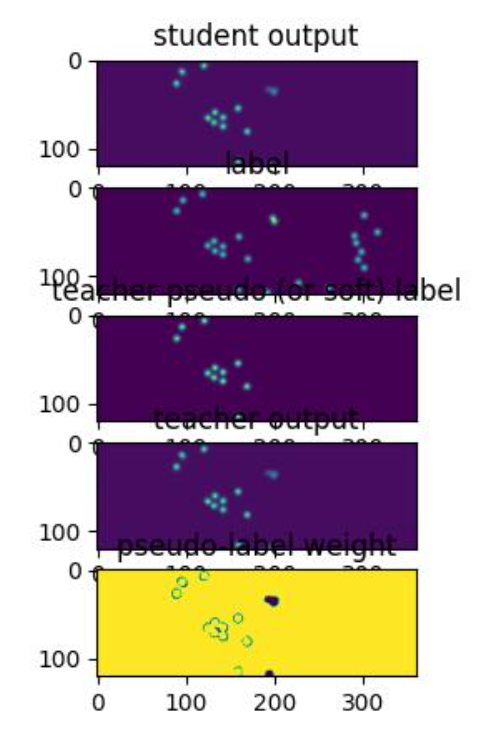
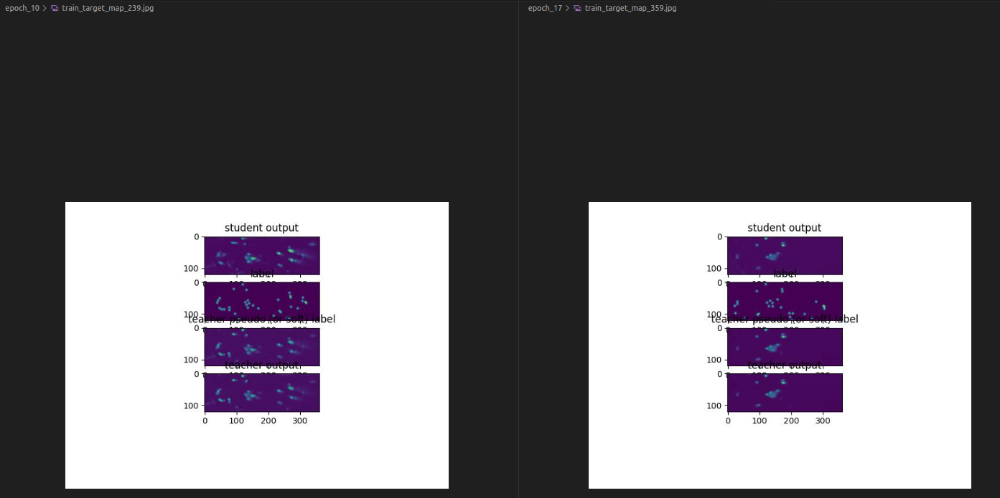
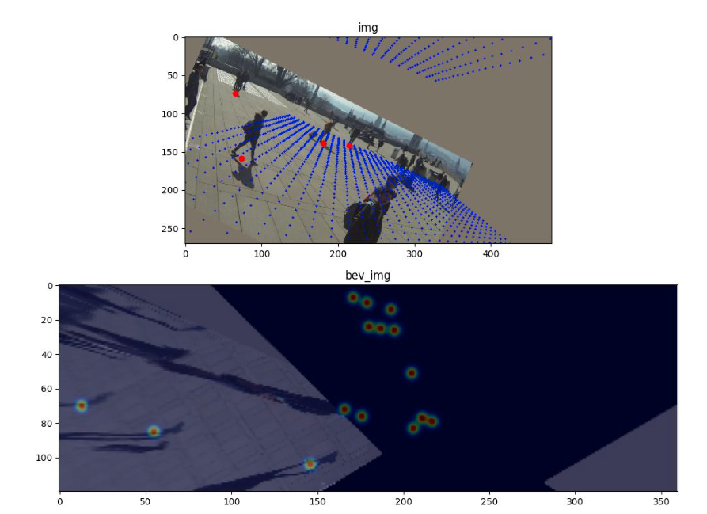

# commands
docker run -it --gpus all --shm-size=8g -v $PWD:/code/ -v /home/gpss1/remote/datasets/Wildtrack_dataset:/data/Wildtrack -w /code mvdet

docker run -it --gpus all --shm-size=8g -v $PWD:/code/ -v /home/gpss1/remote/mnts/mnt0:/mnt -v /home/gpss1/remote/datasets/Wildtrack_dataset:/data/Wildtrack -v /home/gpss1/remote/datasets/MultiviewX:/data/MultiviewX -w /code mvdet

pip install ipykernel

python main.py -d wildtrack --data_path /data/Wildtrack 
python main.py -d multiviewx --data_path /data/MultiviewX 

python main.py -d wildtrack --cam_adapt --train_viz --resume 2024-06-26_11-16-08

python test.py --log_dir /mnt/default/2024-07-02_09-33-24 --data_path /data/Wildtrack --cam_adapt --trg_cams "2,4,5,6" --cls_thres 0.05 --persp_map
python test.py --log_dir /mnt/default/2024-07-02_09-33-24 --data_path /data/Wildtrack --cam_adapt --src_cams "1,2,3,4,5,6,7" --trg_cams "2,4,5,6"

python test.py --log_dir /mnt/2024-09-13_08-36-25-800234 --data_path /data/MultiviewX --dataset multiviewx --avgpool

rsync -r erikbro@alvis1:/mimer/NOBACKUP/groups/naiss2023-23-214/mvdet/results/logs/wildtrack_frame/default mnt0/

# Paper 1 outline

## abstract
We consider the problem of unsupervised domain adaptation for mutli-view pedestrian detection. First, we introduce several training tricks that makes the chosen model (MVDet) more generalizable. Second, we show how performance can be furhter increased by adopting self-training techniques that has been widely used for monocular object detection and semantic segmetnation.
- [ ] contributions
  - [ ] propose training techniques that makes multi-view OD networks more generalizable (permutation augmentation, pretraining, dropout, mvaug)
  - [ ] we propose a multi-view self-training framework for UDA of multi-view pedestrian detection. This includes pseudo-labelling in BEV and projecting the pseudo-labels back into each camera view to be able to leverage perspective view and bev view supervision on target data.
  - [ ] extensive evaluation make our paper a first baseline for multi-view pedestrian UDA. It will serve as a baseline that subsequent papers can use to benchmark their proposed improvements to mutli-view UDA. 

## motivation

I'm mainly interested in camera rig adaptation, as this would be very valuable at Volvo. Camera rig adaptation would allow us to collect training data with a single camera rig and then adapt the model to new installations without need for further annotation work.

Therefore, I am interested in the camera rig adaptation benchmarks proposed in the GMVD paper, which include wildtrack->wildtrack, multiviewx->multiviewX and GMVD->GMVD camera rig adaptation. 

Since I aim to use UDA techniques to perform the camera rig adaptation, and the same techniques are also likely applicable to sim2real adaptation, it makes sense to also include such benchmarks to make the paper stronger.
Previously studied sim2real benchmarks include multiviewX->wildtrack and GMVD->wildtrack.

While I like the generalizability and adaptation benchmarks proposed by GMVD, there are several flaws/shortcuts in their implementation/experiments with MVDet.
By using pretraining, random permutations of camera ordering and mvaug, I've been able to significantly improve MVDet on several benchmarks proposed in GMVD.
This is in itself an achievement.
Furthermore, I've successfully implemented UDA self-training for MVDet on some benchmarks.

**How many models should I evaluate?**  
It seems like my "generalizable" MVDet is almost as good as GMVD, so it is definitely relevant to use this model.  
However, if I do not evaluate any other models, there would of course be some critique. Are my methods applicable to transformer architectures? Other CNN based architectures? CNN networks trained with cross-entropy instead of MSE loss? However, I think that the paper could be published even only with this model.

**How many benchmarks should I evaluate?**  
Since the Wildtrack dataset has a very limited test set, and even data leakage between train and test set (some people standing in the same spot), it would be undesirable to only evaluate on wildtrack->wildtrack adaptation.  
I think I'd rather evaluate a single model on many benchmarks, than evaluating many models on a single benchmark.  
Therefore, the next step is to download mutliviewx and GMVD dataset and evaluate my MVDet implementation on also these benchmarks.  
A risk with introducing sim2real adaptation is that there could be further complications, that are not visible when doing real2real camera adaptation. SOlving these issues may not necessarily benefit the original task of real2real camera rig adaptation. This could result in me spending a lot of time on sim2real adaptation while in reality I'm interested in real2real adaptation. However, I find this risk quite low. I suspect that the two tasks are mutually benefitial (i.e. improvements to sim2real adaptation probably also lead to improvements in real2real adaptation).

## main results

### 2,4,5,6 -> 1,3,5,7

MVDet General 20 epochs (GMVD report 43 moda)  
max_moda: 71.5%, max_modp: 69.0%, max_precision: 95.1%, max_recall: 75.4%, epoch: 17.0%  
max_moda: 70.4%, max_modp: 69.9%, max_precision: 97.3%, max_recall: 72.4%, epoch: 17.0%  
max_moda: 70.2%, max_modp: 70.7%, max_precision: 97.6%, max_recall: 72.0%, epoch: 13.0%  
max_moda: 70.1%, max_modp: 67.1%, max_precision: 95.5%, max_recall: 73.5%, epoch: 11.0%  
max_moda: 72.5%, max_modp: 69.3%, max_precision: 96.0%, max_recall: 75.6%, epoch: 19.0%  
mean ~71

UDA 20 epochs (all valid since UDA always started no later than epoch 10)  
max_moda: 78.7%, max_modp: 71.3%, max_precision: 96.1%, max_recall: 82.0%, epoch: 17.0%  
max_moda: 77.7%, max_modp: 71.7%, max_precision: 96.4%, max_recall: 80.8%, epoch: 13.0%  
max_moda: 79.6%, max_modp: 70.6%, max_precision: 95.8%, max_recall: 83.3%, epoch: 16.0%  
max_moda: 77.3%, max_modp: 70.6%, max_precision: 96.7%, max_recall: 80.0%, epoch: 18.0%  
max_moda: 78.5%, max_modp: 69.9%, max_precision: 95.9%, max_recall: 81.9%, epoch: 15.0%  
mean ~78

### 1,3,5,7 -> 2,4,5,6

MVDet General 20 epochs  
max_moda: 63.7%, max_modp: 66.6%, max_precision: 95.8%, max_recall: 66.6%, epoch: 7.0%  
max_moda: 69.5%, max_modp: 62.5%, max_precision: 92.4%, max_recall: 75.7%, epoch: 10.0%  
max_moda: 68.4%, max_modp: 64.4%, max_precision: 87.1%, max_recall: 80.3%, epoch: 13.0%  
max_moda: 64.8%, max_modp: 64.4%, max_precision: 91.9%, max_recall: 71.1%, epoch: 7.0%  
max_moda: 68.5%, max_modp: 66.0%, max_precision: 90.3%, max_recall: 76.7%, epoch: 19.0%  
baseline moda: 67.0 ± 2.3

UDA 20 epochs  
max_moda: 64.3%, max_modp: 62.6%, max_precision: 95.0%, max_recall: 67.9%, epoch: 16.0%  
max_moda: 74.1%, max_modp: 62.3%, max_precision: 92.8%, max_recall: 80.3%, epoch: 15.0%  
max_moda: 75.6%, max_modp: 62.1%, max_precision: 93.8%, max_recall: 81.0%, epoch: 20.0%  
max_moda: 67.4%, max_modp: 63.5%, max_precision: 88.1%, max_recall: 77.9%, epoch: 10.0%  
max_moda: 73.9%, max_modp: 62.6%, max_precision: 92.2%, max_recall: 80.8%, epoch: 17.0%  
uda moda: 71.0 ± 4.3

### 1,3,5 -> 2,4,6

| model            | moda |
| ---------------- | ---- |
| MVDet default    | 5.8  |
| MVDet general    | 49.3 |
| MVDet uda        | ?    |
| MVDet supervised | 80.6 |

### 2,4,6 -> 1,3,5

max_moda: 65.9%, max_modp: 67.3%, max_precision: 96.7%, max_recall: 68.2%, epoch: 12.0%  
max_moda: 66.1%, max_modp: 65.0%, max_precision: 91.3%, max_recall: 73.0%, epoch: 12.0%  
max_moda: 63.7%, max_modp: 67.5%, max_precision: 95.5%, max_recall: 66.8%, epoch: 17.0%  
max_moda: 67.5%, max_modp: 66.9%, max_precision: 93.9%, max_recall: 72.3%, epoch: 8.0%  
max_moda: 61.9%, max_modp: 67.9%, max_precision: 96.4%, max_recall: 64.3%, epoch: 13.0%  
max_moda: 65.0 ± 2.0

UDA 20 epochs  
max_moda: 74.9%, max_modp: 67.2,%, max_precision: 96.1%, max_recall: 78.0,%, epoch: 18.0% (2024-07-19_15-34-49-648126)    
max_moda: 75.8%, max_modp: 65.1,%, max_precision: 94.3%, max_recall: 80.7,%, epoch: 16.0%  
max_moda: 72.8%, max_modp: 66.3,%, max_precision: 97.1%, max_recall: 75.0,%, epoch: 15.0%  
max_moda: 72.4%, max_modp: 59.8,%, max_precision: 95.0%, max_recall: 76.4,%, epoch: 19.0%  
max_moda: 74.5%, max_modp: 60.7,%, max_precision: 95.7%, max_recall: 77.9,%, epoch: 13.0%  
max_moda: 74.1 ± 1.3      

### MultiviewX 

| model                | moda    |
| -------------------- | ------- |
| MVDet default        | 2.6     |
| MVDet general        | 55.4    |
| MVDet uda            | ?       |
| MVDet supervised     | 70.4    |
| GMVD (with dropview) | 58 (66) |

MVDet General  
max_moda: 53.3%, max_modp: 69.1%, max_precision: 93.4%, max_recall: 57.4%, epoch: 19.0%  
max_moda: 53.9%, max_modp: 68.7%, max_precision: 94.9%, max_recall: 57.0%, epoch: 17.0%  
max_moda: 54.6%, max_modp: 70.3%, max_precision: 96.2%, max_recall: 56.9%, epoch: 20.0%  
max_moda: 56.7%, max_modp: 70.0%, max_precision: 91.6%, max_recall: 62.4%, epoch: 16.0%  
max_moda: 54.6%, max_modp: 66.6%, max_precision: 90.3%, max_recall: 61.1%, epoch: 14.0%  

### GMVD dataset
TODO

# Paper 2 outline

## abstract
We consider the task of UDA for multi-view pedestrain detection. We build upon our recent work that proposed a UDA baseline for multi-view object detection. In this paper, we make at least one improvement. For example, we propose to refine the pseudo-labels using multi-objects tracking algorithms. This leads to increased pseudo-label quality and subsequently increased performance of the student network.

# TODO

Evaluate my implemetnation of MVDet on all relevant adaptation benchmarks. If I'm successful in this, I'd say I could write a draft and submit it to a conference even without implementating additional methods. To make the paper stronger, I would implement the proposed techniques also for other models (e.g., MVDetr, SHOT and GMVD).

- [ ] improve MVDet generalization capabilities with training tricks and boost further with UDA.  
These experiments cover table 3 and 4 of GMVD paper, with the addition of 2,4,6->1,3,5 and 1,3,5->2,4,6
  - [x] 2,4,6 -> 1,3,5
    - [x] baseline
    - [x] improve baseline with generalization tricks
    - [x] improve further with uda
  - [ ] 1,3,5 -> 2,4,6 (ONGOING)
    - [x] baseline
    - [x] improve baseline with generalization tricks
    - [ ] improve further with uda, need to continue parameter search
  - [x] 2,4,5,6 -> 1,3,5,7
    - [x] baseline
    - [x] improve baseline with generalization tricks
    - [x] improve further with uda
  - [x] 1,3,5,7 -> 2,4,5,6
    - [x] baseline
    - [x] improve baseline with generalization tricks
    - [x] improve further with uda
  - [x] 1,2,3,4,5,6,7 -> 1,3,5,7
  - [x] 1,2,3,4,5,6,7 -> 2,4,5,6  
  In the current implementation, I duplicate random cameras (sometimes multiple duplicates), which may yield e.g., 1,3,5,5,5,7,7, in which case only 2 cameras are in the same position as during training. This makes the curent evaluation setting rather difficult. If camera positions where perserved, this benchmark would become presumably much easier. In any case, even in the more difficult setting, my training tricks (MVDet general) reaches good performance (quite close to supervised performance) on both 1,3,5,7 and 2,4,5,6.

- [ ] improve MVDet on camera rig adaptation on multiviewX. This covers table 6 of GMVD paper
- [ ] improve MVDet on camera rig adaptation on GMVD dataset
- [ ] improve MVDet on multiviewX -> wildtrack by training tricks and boost further with UDA.  
Pretraining and dropout here could be valuable since multiviewx contains 6 cameras and wildtrack 7.  
These experiments cover table 5 of GMVD paper.

# UDA baseline

## General
- [x] Plot perspective view foot/head predictions on target data in all cameras (not just one as is done now)
- [x] Investigate what component leads to poor generalization (perspective view feature extraction or BEV detection head)
  - [x] Transform perspective view predictins to 3D
  - [x] Do NMS on in bev
  - [x] on target domain: compare bev detections with transformed perspective view detections 
  - [x] draw some conclusion  
      $\exists$ cases where pedestrians are missed in all views $\implies$ persp. view classifier (and/or feature extractor) is inadequate  
      $\exists$ cases where pedestrians are detected in at least one view but missed in bev $\implies$ bev decoder is inadequate  
      I.e., it seems like both persp. view classifier and bev decoder have generalization issues. We want to improve both of these.
- [x] Check why pseudo-labels are very different from teacher predictions after training's finished (see logs 5/7)
  - [x] fixed bug in code
- [x] Check why test scores are different during training and testing (see logs 5/7)
  - [x] fixed bug in code
- [x] run scene generalization exps on e.g., 1,3,5 -> 2,4,6. It makes sense to try with zero cameras overlapping. On the other hand, such scenarios are available in GMVD dataset
- [x] run exps with pretrained resnet18 (simply to set pretrained=True in this repo)
- [x] implement early stopping (saving the model with highest moda and printing best results after training's finished)
- [ ] UDA with confidence weighted cross-entropy
  - [ ] implement cross-entropy loss and train domain generalization network
  - [ ] implement confidence weighted cross entropy in UDA setting

### implement EMA teacher

- [x] EMA teacher
  - [x] implement
  - [x] test ema teacher (train only on supervised and simply keep an EMA teacher on the side. Then test the EMA teacher after training's finished.)

### create pseudo labels
- [x] train with soft labels
- [ ] train with confidence weighted MSE loss
  - [ ] create confidence scores from model prediction which is in range -infty to +infty
- [ ] create pseudo-labels in bev and perspective view separately
  - [x] find probabilities and argmax
  - [ ] non-maximum supression
  - [ ] perspective view 
- [x] train with pseudo-labels
- [x] create pseudo-labels in bev and project into perspective view
  - [x] find the pos of pseudo-labels in bev
  - [x] project pos to cameras
  - [x] plot pseudo-labels during training

The model predicts both head/feet positions in each image as well as occupancy map in bev. 
It seems natural that the student should be supervised in both perspective and bev view also on target data.

1. use the teacher's soft labels (predictions) in both perspective and bev view.
    For this option, I should not run a gaussian kernel over the teacher predictions, as this will merely make them even more uncertain.
2. convert teacher's predictions to pseudo-labels in both perspective and bev view
    Here, it could make sense to run the gaussian kernel (treat the pseudo-labels exactly like real labels)
3. create pseudo-labels only in bev. Then project these labels into the images and supervise with pseudo-labels both in perspective and bev.
    Again, it makes sense to run the gaussian kernel.

Assuming that training with pseudo-labels is more beneficial and that the preds in bev view are more accurate than those in image view, option 3 should be most favourable.

Option 1 has a natural "confidence weighting" as we use the MSE loss. I.e., for a teacher detection with ~0.7 confidence, the loss will not be as large if the student is incorrect as it would have been for a teacher detection with ~1 confidence.
For option 2 and 3, it could make sense to introduce confidence weighting to reduce the impact of noisy regions. This should be easy to do with a simple weighted MSE loss, where the weight is chosen as the confidence.

### data augmentation
- [x] dropview (GMVD propose to always drop one camera. I believe that it could be better to sometimes include all cameras, e.g., set a proability of dropping one camera)
  - [x] Train baseline cam_adapt with dropview on source (no uda)
  - [x] Train UDA self-training with dropview on source and target
- [x] permutation augmentation (change the ordering of cameras). This could make the BEV decoder less overfit to a specific camera rig. 
- [ ] 3DROM
- [x] MVAug

Strong data augmentation should be used for the student.
Different options exist.

1. use 3D random occlusion (introduced by 3DROM)
2. use MVAug data augmentation (warping of images)
3. use drop-camera (GMVD), i.e., student sees fewer cameras than the teacher. An option here is to supervise the student in perspective view in all cameras, but drop one as it creates the bev predictions. Note that when GMVD introduced the dropview augmentation, they could simply skip a camera with their architecture since they use average pooling. However, for e.g., MVDet, they must process the dropped view since the architecture doesn't allow for decreasing the number of cameras. A natural choice is to set the dropped view to all zeros, however, GMVD chose to duplicate one of the other views instead. I feel like this should result in a "false" training signal as there is a risk of fooling the network. It seems much better to set it to all zeros, which is what I will do.

### ramp-up adaptation
- [x] target loss weight increases as confidence of pseudo-labels increase
  - [x] Since there is no obvious method for measuring the model's confidence (it outputs real values and tries to match the ground truths which has been gaussian smoothed), I resort to a hard-coded schedule for progressively increasing the focus on target domain.

### other UDA concepts
- [ ] ImageNet feature distance as introduced by DAFormer

There should probably be more focus on accurate source labels in the beginning, and then successively focus is shifted to target domain as the quality of the pseudo-labels increase.

# Experiments

### all cameras MVDet baseline
/mimer/NOBACKUP/groups/naiss2023-23-214/mvdet/results/logs/wildtrack_frame/default/2024-07-01_18-07-44
slurm-2464253_3  
moda: 87.4%, modp: 75.5%, precision: 93.2%, recall: 94.2%

### cam_adapt 1,3,5,7 -> 2,4,5,6
slurm-2465377_5  
/mimer/NOBACKUP/groups/naiss2023-23-214/mvdet/results/logs/wildtrack_frame/default/2024-07-02_10-44-47

### cam_adapt 2,4,5,6 -> 1,3,5,7
slurm-2465263_4
/mimer/NOBACKUP/groups/naiss2023-23-214/mvdet/results/logs/wildtrack_frame/default/2024-07-02_09-33-24

testing on 2,4,5,6 (test_1)  
moda: 83.5%, modp: 72.8%, precision: 94.7%, recall: 88.4%  
(Results from GMVD paper: 85.2, 72.2, 92.6, 92.)

testing on 1,3,5,7 (test_0)  
moda: 18.2%, modp: 70.2%, precision: 76.6%, recall: 26.2%  
(Results from GMVD paper: 43.2, 68.2, 94.6, 45.8)

Making predictions on training dataset to see the "pseudo-labelling capability" of the model
cls_thresh=0.05 2024-07-02_09-33-24/test_13  
cls_thres=0.2 test_12  
cls_thres=0.4 test_11  
As expected, the quality of pseudo-labels is relatively poor. cls_thres=0.2 seems most reasonable out of the three.

It can be seen that my experimental results match those of the GMVD paper relatively well, although, the moda and recall is a bit lower than expected on 1,3,5,7.

### verifying EMA teacher on 2,4,5,6->1,3,5,7
Only training on source, but updating the ema throughout training.  
experiment folder: /mnt/default/2024-07-05_09-48-35  
using cls_thres=0.4 in all the below experiments

Performance of "student" on 2,4,5,6 (test 0)
moda: 82.9%, modp: 73.4%, precision: 91.3%, recall: 91.6%

Performance of ema on 2,4,5,6   (test 1)
moda: 81.1%, modp: 73.1%, precision: 89.1%, recall: 92.3%

The ema performance similarly to the student, but not exactly the same, which is expected. => EMA implemetnation seems OK.

is it beneficial to use ema in this setting?
From below experiments, it doesn't seem like ema by default has better generalization capabilities.

Performance of "student" on 1,3,5,7 (test4)  
moda: 18.1%, modp: 70.5%, precision: 70.8%, recall: 30.8%  

Performance of ema on 1,3,5,7 (test 3)  
moda: 18.7%, modp: 68.9%, precision: 68.9%, recall: 34.1%

### student-teacher soft labels (no augmentation) on 2,4,5,6->1,3,5,7
/mnt0/default/2024-07-05_17-02-52-550235  
slurm-2478540_15  
target_weights:  [0.0, 0.0, 0.0, 0.0, 0.0, 0.0, 0.0, 0.0, 0.8135804472781414, 0.9238205812014586]

2,4,5,6 scores (available in test_0):  
moda: 80.8%, modp: 73.2%, precision: 88.1%, recall: 93.4%

1,3,5,7 scores  (available in test_1):  
moda: 21.6%, modp: 69.3%, precision: 72.0%, recall: 35.4%

Seems like student-teacher training with soft-labels may give very slight performance boost, or at least doesn't hurt performance.  
Maybe the performance boost will come when I introduce augmentation.   

### student-teacher pseudo-labels (no augmentation) on 2,4,5,6->1,3,5,7
/mnt/default/2024-07-05_16-57-33-979160  
slurm-2478540_2  
target_weights:  [0.0, 0.0, 0.0, 0.0, 0.0, 0.0, 0.0, 0.0, 0.18508207817320688, 0.9442114246448788]  
pseudo_label_th:  0.38431918345836336  

1,3,5,7 scores  
cls_thres=0.4 (available in test_0)  
moda: 12.6%, modp: 70.1%, precision: 88.2%, recall: 14.5%  

cls_thres=0.3 (available in test_1)  
moda: 18.2%, modp: 69.8%, precision: 80.4%, recall: 24.1%  

cls_thres=0.2 (available in test_2)  
moda: 22.0%, modp: 68.9%, precision: 69.6%, recall: 39.0%

Also seems like an okay result.  But still no clear improvements.

Note that all the 9 other similar experiments lead to very poor performance with ~90 % recall and ~0 % precision. The reason seems to be that the pseudo-label threshold was set too low, resulting in many false positive pseudo-labels. The conclusion is that the pseudo-label threshold should probably be at least ~0.35. Perhaps 0.35-0.45 is a reasonable range (although the maximum value I tried in the previous 10 experiments was 0.38).

### verifying dropview  2,4,5,6 -> 1,3,5,7
previous experiment 2024-07-02_09-33-24 (without dropview) gets test-scores on 1,3,5,7 without and with dropview during test-time:

moda: 83.5%, modp: 72.8%, precision: 94.7%, recall: 88.4%  
moda: 46.9%, modp: 71.3%, precision: 94.4%, recall: 49.9%

New experiment 2024-07-09_09-32-28-836149 gets the scores

moda: 74.4%, modp: 70.7%, precision: 86.9%, recall: 87.6%  
moda: 56.2%, modp: 69.7%, precision: 88.2%, recall: 64.9%

It can be seen that the regular test-score is a bit worse after training with dropview. This is reasonable since using dropview during training may make it harder for the model to exploit information from all 4 views simultaneously.  
However, after training with dropview, we see that the performance doesn't drop as much when using test-time dropview.  
Conclusion: dropview seems to work. However, it is probably not beneficial to use dropview in every iteration, as this may make it more difficult for the model to exploit all views during test time.

### verifying permutation augmentation 2,4,5,6 -> 1,3,5,7
Two exps training only on soruce data:
one where the permutation is merely change (permutation = [3,0,2,1]), should yield similar performance as long as cam 5 is in the same position.  
Another where the permutation augmentation is used (new permutation every iteration). Now, performance on 1,3,5,7 will probably drop significantly as camera 5 is not always in the same place.

With permutation=[3,0,2,1]:  
moda: 32.6%, modp: 67.5%, precision: 89.1%, recall: 37.1%  

with random permutation:  
moda: 44.0%, modp: 67.8%, precision: 92.8%, recall: 47.7%

Conclusion: permuattion seems to be implemented correctly. And it seems beneficial with random permutation even though camera 5 is on the same place in train and test.

### verifying MVaug augmentation 2,4,5,6 -> 1,3,5,7
Training with mvaug augmentation (only 30 degrees though, and no scale/sheer)

On 1,3,5,7:  
moda: 30.5%, modp: 66.2%, precision: 90.5%, recall: 34.0% (with incorrect parameters of raff, i.e. only 30 % rot)

moda: 40.0%, modp: 65.3%, precision: 94.8%, recall: 42.3% (with GMVD parameters of raff, i.e. rot 45% etc, although 100% augmentation probability)

On 2,4,5,6:  
moda: 76.8%, modp: 65.2%, precision: 92.5%, recall: 83.5%

Conclusion: Performance on 1,3,5,7 is slightly better than the baseline, while performance on 2,4,5,6 is slightly worse. So, while the augmentation makes the model generalize better, it makes it a bit more difficult to fit to the training data. Seems reasonable.

Notes: since precision was really high while recall was low, I also tried lowering the cls_thres to 0.2, which resulted in predictions seen in the image. The main issue is that there are a lot of false positives right at the edge of the bev map, which probably comes from the fact that there are a bunch of people sitting and standing there, as seen in the perspective image of camera 7. It could be that if the bev view was larger, then the nms would remove these predictions as the maximum actually lies outside the region of interest. It seems reasonable that any model based on NMS a prone to having issues at the boundaries. However, I suppose one could also argue that these points shouldn't receive so high scores in the first place.  
  

### MVAug + random permutation 2,4,5,6 -> 1,3,5,7

On 1,3,5,7:  
moda: 53.7%, modp: 63.1%, precision: 92.2%, recall: 58.6%

Conclusion: both random permutation and mvaug improve generalization capabilities individually, but the combination of the two yields the highest performance.

### generalizable exp (pretrained, mvaug, permutation) 2,4,5,6 -> 1,3,5,7
2024-07-16_10-20-24-986906

On 2,4,5,6  
moda: 81.6%, modp: 70.8%, precision: 95.9%, recall: 85.3%

On 1,3,5,7  
moda: 67.3%, modp: 68.8%, precision: 96.1%, recall: 70.2%

One of the failure cases on the test ( 1,3,5,7) set is shown below. While the five-people-group is quite clearly detected in cam7, the score in bev for this group of people is low, so none of them are detected. It so happens that these people are partly occluded in cam5 in this frame, which may be the reason they are not detected.  

Concluding remarks: in this case, it may be difficult to construct reliable pseudo-labels in bev because the detections are very uncertain. On the other hand, the detections in cam7 seems reliable, so it may be a good idea to use these detections in self-training. Furthmore, we can conclude that since the detections in cam7 are of high quality, surely the image features of cam7 is also of high/decent quality. As such, the bev features derived from these image features are also of good quality (since we merely perform bilinear sampling). The poor bev predictions is thus a result from inadequate decoding of the bev features. It could be that the bev decoder is fooled by poor features from the other cameras, or that it simply doesn't deem the high quality features from cam7 to provide enough evidence for the detections.

Hypotheses:  
1. The bev predictions are typically of lower quality than the perspective view predictions. 
2. Sometimes the bev predictions are better, and sometimes the perspective view predictions are better.
3. The bev predictions are typically of higher quality than the perspective view predictions.

Possible methods to perform UDA under hypotheses:
1. it is best to use perspective view predictions for self-training. We could project the soft-labels of each camera to bev and create a single bev soft label by either averaging or max pooling. Soft bev label can then be projected to each camera view. Or we could create hard labels at some point
2. It is best to use a combination of perspective and bev view predictions for self-training. We could use a heuristic method to fuse the perspective view predictions with the bev predictions. E.g., project perspective view soft/hard preds to bev and do averaging or max pooling together with the bev predictions. The combination of both perspective view and bev predictions may be more reliable than either one separately.
3. it is best to only use the bev predictions for self-training. Create soft or hard labels using bev predictions. 

An option to smoothly cover all three cases with a single hyper parameter could be to create two separate loss terms, i.e. $(1-\alpha)*L_{persp} + \alpha*L_{bev}$ and let $L_{persp}$ be the loss derived from soft/hard labels in bev produced by perspective view predictions, and $L_{bev}$ be the loss derived from soft/hard labels in bev produced by bev view predictions. Then I could adjust $\alpha$ from 0 to 1 to address hypothesis 1,2 and 3.

### wildtrack 2,4,6 -> wildtrack 1,3,5
2024-07-16_15-16-37-676024

| pretrained | permutation | mvaug | dropview | scores                                                                                 |
| ---------- | ----------- | ----- | -------- | -------------------------------------------------------------------------------------- |
| -          | -           | -     | -        | max_moda: 10.8%, max_modp: 41.4%, max_precision: 85.0%, max_recall: 13.1%, epoch: 2.0% |
| x          | x           | x     | x        | max_moda: 54.2%, max_modp: 65.5%, max_precision: 89.6%, max_recall: 61.3%, epoch: 6.0% |

Like the experiment on 2,4,5,6 -> 1,3,5,7, the group of five people is not detected in frame 24 by the bev decoder.  
Additioanlly, none of the perspective view predictions provide confident prediction of this group of people (probably due to the heavy occlusion at this point in time). This was not the case when using 1,3,5,7 as then camera 7 provided quite confident detections. 
So on 2,4,6 -> 1,3,5, there are definitely cases where neither perspective views nor bev decoder can detect certain people.  
We can probably conclude that it is due to inadequate feature extraction in the image plane that the group of people cannot be detected under occlusion. As they are in fact partly visible in two of the cameras, it seems sensible that they could be detected given more training on such difficult partly occluded samples. 
There exist many frames where the bev predictions projected into some of the cameras could give supervision on such partly occluded samples, so here self-training on bev predictions could make sense.

### generalization summary
2,4,5,6 -> 1,3,5,7  
| pretrained | permutation | mvaug | dropview | scores                                                                                  | save_dir                   |
| ---------- | ----------- | ----- | -------- | --------------------------------------------------------------------------------------- | -------------------------- |
| -          | -           | -     | -        | max_moda: 28.9%, max_modp: 66.6%, max_precision: 95.4%, max_recall: 30.4%, epoch: 4.0%  |                            |
| x          | -           | -     | -        | max_moda: 41.1%, max_modp: 70.3%, max_precision: 98.5%, max_recall: 41.7%, epoch: 5.0%  |                            |
| -          | x           | -     | -        | max_moda: 59.0%, max_modp: 66.9%, max_precision: 93.0%, max_recall: 63.9%, epoch: 5.0%  |                            |
| -          | -           | x     | -        | max_moda: 44.5%, max_modp: 67.0%, max_precision: 90.3%, max_recall: 49.9%, epoch: 9.0%  |                            |
| -          | x           | x     | -        | max_moda: 56.4%, max_modp: 66.4%, max_precision: 93.5%, max_recall: 60.6%, epoch: 10.0% |                            |
| x          | x           | x     | -        | max_moda: 67.3%, max_modp: 68.8%, max_precision: 96.1%, max_recall: 70.2%, epoch: 9.0%  | 2024-07-16_10-20-24-986906 |
| x          | x           | x     | x        | max_moda: 65.7%, max_modp: 68.8%, max_precision: 95.4%, max_recall: 69.0%, epoch: 10.0% |

MVDet+avgpool: 69.5 max_moda
MVDet+avgpool+dropview+mvaug: 74.2
GMVD (from paper): 66.5 moda
GMVD+dropview (from paper): 75.1 moda

1,3,5,7 -> 2,4,5,6   
| pretrained | permutation | mvaug | dropview | scores                                                                                  |
| ---------- | ----------- | ----- | -------- | --------------------------------------------------------------------------------------- |
| -          | -           | -     | -        |                                                                                         |
| x          | -           | -     | -        |                                                                                         |
| -          | x           | -     | -        |                                                                                         |
| -          | -           | x     | -        |                                                                                         |
| -          | x           | x     | -        |                                                                                         |
| x          | x           | x     | -        | max_moda: 59.9%, max_modp: 64.0%, max_precision: 92.0%, max_recall: 65.5%, epoch: 7.0%  |
| x          | x           | x     | x        | max_moda: 54.0%, max_modp: 64.1%, max_precision: 96.7%, max_recall: 55.9%, epoch: 10.0% |

Notes: my best results are competitive with GMVD, although still slightly worse. But they are **much** better then the results reported on MVDet by GMVD.

Although both permutation and mvaug bring improvements separately (when not using pretrained weights), permuatation+mvaug is alightly worse than only permutation. However, while max_moda is achieved at epoch 5 with only permutation, it is achieved at epoch 10 with permutation+mvaug, suggesting that the model may not have reached it's max performance yet.
=> I should increase the number of epochs slightly to allow for longer trainings when doing aggressive data augmentation.

wildtrack 2,4,6 -> wildtrack 1,3,5
| pretrained | permutation | mvaug | dropview | scores                                                                                 |
| ---------- | ----------- | ----- | -------- | -------------------------------------------------------------------------------------- |
| -          | -           | -     | -        | max_moda: 10.8%, max_modp: 41.4%, max_precision: 85.0%, max_recall: 13.1%, epoch: 2.0% |
| x          | x           | x     | x        | max_moda: 54.2%, max_modp: 65.5%, max_precision: 89.6%, max_recall: 61.3%, epoch: 6.0% |

In my experiments, I've discovered different types of failure cases:
1. pedestrians are missed in all cameras and in bev (e.g. group of five in frame 24 on 2,4,6->1,3,5)
2. pedestrians are missed in bev, but detected in at least one camera (see above section of  2,4,5,6 -> 1,3,5,7)
3. pedestrian is detected in bev, but "more or less" missed in all cameras (i.e., no camera alone provides strong evidence for the detection, .e.g woman in brown cote, one of the most right-most detections in frame 7 of 2,4,6->1,3,5)

Here, we could say that failure 1. probably is due to inadequate feature extraction in perspective view. We need to improve the perspective view feature extraction to handle these errors.  
Failure 2 is due to inadequate fusion of the image-view features. I.e., while image view feature extraction is "good enough", the bev fusion is not well adapted and produces the error. We need to make the bev decoder better to handle these errors.  
Failure 3 indicates a capable bev decoder, while the poor image features makes detection difficult. We could probably benefit from better image view feature extraction. 

Other failure cases include:
1. detections are inaccurate in all cameras and in bev (e.g., two pedestrians are not clearly separated and may appear as one detection, e.g. frame 14 of 2,4,6->1,3,5)
  

# Notes
- Camera C3 is not undistorted properly. Perhaps they use another cameramodel for this camera? The projection of points looks alrgiht, although lines does not appear straight in this camera.
- Isn't it strange to evaluate 2,4,5,6->1,3,5,7 since camera 5 is avialable (and in the same ordering) in both camera rigs? Perhaps we are basically just evaluating the models "single camera" performance, using only camera 5, while cameras 1,3,7 are useless.
- GMVD uses resnet18 pretrained with ImageNet. In this repo, no pretrained weights are loaded originally. However, we can easily set pretrained=true when building resnet18. Then weights will be loaded from 'https://download.pytorch.org/models/resnet18-5c106cde.pth' , but it doesn't say what type of weights this is (imagenet?).
-  How are predictions outside the platform treated? Are they simply ignored or do they lead to lower precision since they are not in the labels?  
- predictions close to the boarder of the bev grid (region of interest) are problematic since nms doesn't really work on the boarder. If we would extend the predictions bev grid such that it is larger than the evaluation bev grid, it could be that nms finds that predictions that where originally inside the bev roi, would instead be outside.

### Tracking
GMVD introduces new benchmarks for evaluating the generalizability of multi-view detectors. They evaluate MVDet, MVDetr, SHOT and GMVD on these benchmarks.
However, they haven't adopted any UDA/SSL techniques.

If I am to use the GMVD benchmarks, it makes sense that I compare with their paper.
One proposal is to:
1. Apply student-teacher self-training to MVDet, MVDetr, SHOT and GMVD, to see if the results from GMVD paper can be improved. Perhaps even the ordering of the results will change? I.e., while some methods are better at directly generalizing, they may not compare as favorably after adaptation.
2. Further investigate how tracking can be incorporated in student-teacher self-training. The idea is that tracking can reduce the noise in the pseudo-labels.
3. Alternatively, investigate design of architecture or training specifics to make the bev-features more generalizable. Perhaps adversarial training can be used to achieve "domain-invariant" BEV features? Or maybe unsupervised training with some MAE variation can be used?

Student teacher self-training will be applied in an UDA setting, where labels are available for some cameras (training) and unavailable for the testing cameras. It also makes sense to evaluate it for sim2real adaptation. Maybe that is enough of a scope? I can skip introducing semi-supervised benchmarks, and I can perhaps also skip introducing more unlabeled data.
However, if I use the same data for training cams and testing cams, the labels could easily be propogated from train to test cams. If I want to avoid this, I should perhaps use other unlabeled data for the test cameras.

Can I apply some standard tracking methodology to MVDet, MVDetr, SHOT and GMVD? The CV-LAB at EPFL implements the min-cost max flow algorithm MuSSP for MOT that e.g., MVFlow used in their paper. Seems like tracking is performed only based on detections in 3D, using the location and probability of detection. Seems easy enough to implement and adopt for other methods.
In MVFlow, they already evaluated MVDet + MuSSP and MVDetr + MuSSP, which performs quite well. 

MVFlow, MVDet, MVDeTr, GMVD are implemented in pytorch.

I wonder how missed detections are handled in the min cost max flow formulation? Can a track skip a timestep and continue later?

# log book
### 1/7
started baseline experiments

### 2/7
The experiemnts yesterday didn't turn out well. The model cannot generalize. From the appearance of the predictions, it seems like the wrong calibration matrices are used.  
Indeed, it seems like the code is incorrect.  Iä've fixed this and started new experiments on cam_adaptation.  

After above fix, the model generalizes almost equally "well/poorly" as described in GMVD, so it seems like the implementation is correct.

I've started experimenting with self-training, but without good results yet.
It is evident that after training only on source, the pseudo-labels on target are of poor quality.
This is expected, and given the results of "Toward unlabeled multi-view 3D pedestrian detection by generalizable AI: techniques and performance analysis", I don't believe that it is worth attempting a naive iterative pseudo-labeling training.
Instead, it is time to implement the mean teacher and experiment with a "smooth" transition to the target data.

### 3/7
The experiement with the ema teacher didn't lead to good performance, but the implementation seems to work.
Before starting loads of experiments on the EMA self-training to find good hyperparameters (i.e., EMA and target weight schedule), I should probably verify tthat the ema teacher works.

I should also figure out whether it is the perspective view backbone or the BEV detection head that has poor generalization capabilities. I would expect that the (ImageNet pretrained) backbone can generalize to new images fairly well, while the BEV detection head overfits to the specific camera setup. An adaptation strategy would in this case involve ensuring that the BEV feature map and detection head becomes more general.

One idea is to use **Domain Invariant Feature Learning** to learn BEV features that are invariant to the camera rig.
- Assumption: Projection to ground plane results in bev features that have appearance heavily dependant on the camera setup (since e.g. pedestrians are smeared out on the floor differently based on the camera angle).
- Applying a few conv layers onto the BEV projection and then enforcing domain invariance on the features could perhaps lead to more "true" BEV features, where the pedestrians are well localized and look like they are actually viewed from above. This is reasonable since a "true" BEV view is independant of the camera rig.
- It is critical that the above (presumably domain invariant) features are also used for subsequent detection. Training on source labels for detection jointly with the above adversarial training can assure that the features do not collapse to nonsense, since the detection supervision will enforce rich features.

Another idea to attain BEV features that are more or less independent of the camera rig is to use the method presented in MVTT. Here, they first use bounding boxes to aggregate perspective view features and then project this feature vector (a single vector per pedestrian) onto a sparse BEV feature map. The drawback with this is that the feature aggregation is very much determined by single view detection performance.

### 4/7 
Created BEV predictions by only using perspective view detections. I.e., make detections in perspective view -> project them all to bev -> NMS to get final bev predictions.

These predictions are competitive with the standard BEV predictions in the cam adaptation setting. However, they are not better, so it is not clear whether the domain gap lies mainly in the perspective view backbone or in the bev decode head.  
There are a few problems with the evaluation above.  
First, since the perspective view is trained to detect feet (rather than pedestrians), it cannot detect any pedestrian that is too close to the camera.  
Second, the above scheme tests also the perspective view to bev projection and sensor fusion algorithm. It is not a precise evaluation of the perspective view prediction quality.  
It would perhaps be better to evaluate the adaptation capabilities of the perspective view backbone **in** the perspective view.
Alt 1. evaluate perspective view detections per camera.  
Alt 2. evaluate the joint perspective view detections (for example, are there any pedestrian that is missed in all cameras?)  

When evaluating different camera setups, it would be helpful to plot the field of views of each camera in the bev map to understand which parts of the bev we can expect detections in.  

After training on "2,4,5,6" the output on cam2 looks like below.  
It can be seen that the network doesn't provide very confident predictions in perspective view even on the cameras that are included in the train set.

When evaluating on "1,3,5,7", the predictions in camera 3 looks like below.  
The quality seems to be similar to the predictions in the training set.  
To confirm this quantitatively, maybe I should just print the loss? Rather than printing MODA/MODP, as this would require me to set thresholds and do NMS.

### 5/7
When running student teacher self-training with  
dropview :  False  
soft_labels :  False  
target_epoch_start:  6  
target_weight_start:  0.8442657485810173  
target_weight_end:  0.9778772670996941  
pseudo_label_th:  0.3541755216352376  

folder: 2024-07-05_15-21-12-552959  
slurm-2478176_0  

The predictions during training looks very strange (see below)  

But when evaluating the final model, the predictions looks quite alright  

preds of ema teacher on test set are available in test_3  
preds of ema teacher on train set are available in test_4  
The ema teacher preds on train set in test_4 doesn't match the pseudo-labels produced during training at all... Strange! Seems to be something wrong with the implementation.  

Also, I don't yet understand why test scores (MODA/MODP etc) evaluated during training are very differetn from the same scores produced by test.py.  

### 8/7

Training with pseudo-labels or soft labels yields decent performance in some experiments.  
Pseudo-label threhsold should be ~0.35-0.45 (at least no less than 0.35, as this yhields many false positives).  

Time to run similar experiments with data augmentation.

**Why do we compute precision and recall in two different ways in test?**  
The test script report results in the below format:  
moda: 20.8%, modp: 69.5%, precision: 67.0%, recall: 41.0%  
Test, Loss: 0.007522, Precision: 2.6%, Recall: 39.1,    Time: 33.777  
where the first line gets the result from evaluatedetection.py, which uses NMS and hungarian algorithm for matching, while the second line simply sets as cls_thres  
and computes precision and recall without nms or hungarian algorithm. Typically, many pixels/squares exceed  the cls_thres, resulting in many false positives.

### 9/7
There was a bug in the code, resulting in the source camera matrices where used also when training on target data in the UDA setting.  
This resulted in bad pseudo-labels, as seen in 2024-07-05_15-21-12-552959 .  
After fixing this, the pseudo-labels makes more sense: 2024-07-08_18-12-16-463172 .  
Also, the test scores during training/test are the same now. So a lot of progress today!

How are predictions outside the platform treated? Are they simply ignored or do they lead to lower precision since they are not in the labels?  
Any good UDA technique is probably expected to detect the pedestrians outside the region of interest as humans, so I think that they should be ignored in the evaluation.  
Or perhaps it is okay to supervise the target domain not to predict pedestrians in this region, for fair evaluation?

### 10/7 working on implementing MVAug

in frameDataset, the self.transform includes a resize(720, 1280), which makes the loaded images smaller. However, I don't find anywhere in the code that the projection matrices
are adjusted because of this.
I believe that my current visualization of bev-image is slightly wrong due to this scaling 1920/1280 = 1.5.
Maybe this doesn't matter for the MVDet code since they anyway normalize the image coordinates to [-1, 1] in kornia.warp_perspective, but it may cause issues for me.

I have succeded in warping the input images as well as the foot gt coordinates so that they align with the warped image.

I've also warped the bev label, but I'm not sure if this is done correctly since they seem to use an entirely different technique in MVAug.

I've also figured out that while MVDet uses a projection matrix for image -> bev, MVAug uses a projection matrix for bev -> image.
It is essential that I use the MVAug matrix for the MVaug augmentations, otherwise things won't work.

TODO
- [x] successfully create bev images for unaugmented and MVaugmneted images
- [x] apply the same bev-projection to image features instead of RGB image and check results
- [x] repeat the above two steps now also using scene augmentation

### 15/7
TODO:  
if mvaug is not used, the proj_mats in proj_mats_mvaug_features will not be inverted, i.e., subsequent calls to mthe model will not work.  

MVAug implementation seems correct now.  
It is time to start doing some experiments:

- [x] generalization experiment (only mvaug, compare with only random perm)
- [x] generalization experiment (mvaug + random perm) 

### 16/7
- [x] only 50% of data should be augmented with MVAug according to GMVD
- [x] implement early stopping (saving the model with highest moda and printing best results after training's finished)
- [x] implement weak aug for teacher and strong aug for student (weak mvaug  + random perm for teacher, strong mvaug + random perm + dropview for student)
- [x] run exps with pretrained resnet18 (simply to set pretrained=True in this repo)
- [x] implement dropview probability

Should I examine other adaptation benchmarks before trying to device an adaptation strategy. Yes, I believe that is a good idea. Study a few more relevant benchmarks to select the hypothesis which is most likely to be true. Then I will device an UDA method to address the chosen hypothesis.

- [ ] multiviewx -> wildtrack. The performance of MVDet reported in GMVD on this benchmark is low, but I believe I can pump it up with my augmentation techniques.
- [ ] multiviewx -> multiviewx as proposed by SHOT
- [x] wildtrack 2,4,6 -> wildtrack 1,3,5

### 17/7
- [x] uda trainings on 2,4,6->1,3,5

baseline:   
max_moda: 68.9%, max_modp: 66.7%, max_precision: 91.8%, max_recall: 75.6%, epoch: 8.0%

uda experiments:  
target_weights:  [0.0, 0.0, 0.0, 0.0, 0.0, 0.0, 0.529442357047416, 0.5537716176786276, 0.5781008783098391, 0.6024301389410507]
pseudo_label_th:  0.4196905898765535
max_moda: 65.5%, max_modp: 62.2%, max_precision: 98.0%, max_recall: 66.9%, epoch: 8.0%

target_weights:  [0.0, 0.0, 0.0, 0.47958319143093275, 0.5507580172662846, 0.6219328431016363, 0.6931076689369882, 0.7642824947723399, 0.8354573206076917, 0.9066321464430436]
pseudo_label_th:  0.39977931854928195
max_moda: 68.8%, max_modp: 64.3%, max_precision: 95.5%, max_recall: 72.2%, epoch: 9.0%

target_weights:  [0.0, 0.0, 0.0, 0.08801375805758505, 0.14867617584590007, 0.2093385936342151, 0.27000101142253013, 0.33066342921084513, 0.3913258469991602, 0.4519882647874752]
pseudo_label_th:  0.41709663880397635
moda: 66.0%, modp: 62.2%, precision: 96.4%, recall: 68.5%
max_moda: 69.6%, max_modp: 62.7%, max_precision: 94.3%, max_recall: 74.2%, epoch: 6.0%

target_weights:  [0.0, 0.0, 0.5656575015469459, 0.6174317863351922, 0.6692060711234386, 0.720980355911685, 0.7727546406999313, 0.8245289254881776, 0.8763032102764239, 0.92807749506]
pseudo_label_th:  0.43602802542276353
max_moda: 60.0%, max_modp: 61.9%, max_precision: 98.6%, max_recall: 60.8%, epoch: 8.0%

target_weights:  [0.0, 0.370242316115, 0.38931753997, 0.40839276384, 0.4274679877, 0.4465432115647331, 0.46561843542701653, 0.4846936592893, 0.5037688831515835, 0.522844107013]
pseudo_label_th:  0.3942720007566877
max_moda: 32.1%, max_modp: 58.6%, max_precision: 91.8%, max_recall: 35.3%, epoch: 2.0%

target_weights:  [0.508953068, 0.52522553, 0.541498005, 0.55777047, 0.5740429416, 0.5903154099442736, 0.6065878782040469, 0.6228603464638203, 0.6391328147235935, 0.6554052829833669]
pseudo_label_th:  0.3980698068588894
max_moda: 20.4%, max_modp: 61.4%, max_precision: 98.0%, max_recall: 20.8%, epoch: 8.0%

target_weights:  [0.0, 0.0, 0.0, 0.0, 0.9930710435442112, 0.9943342358059472, 0.9955974280676831, 0.9968606203294191, 0.9981238125911551, 0.9993870048528911]
pseudo_label_th:  0.3169209365784296
moda: 0.0%, modp: 54.3%, precision: 14.1%, recall: 86.4%
max_moda: 62.4%, max_modp: 59.4%, max_precision: 88.3%, max_recall: 72.0%, epoch: 5.0%

target_weights:  [0.0, 0.0, 0.0, 0.0, 0.0, 0.0, 0.9097386222697896, 0.9179633911828667, 0.9261881600959438, 0.934412929009021]
pseudo_label_th:  0.38797777902092656
max_moda: 69.4%, max_modp: 64.0%, max_precision: 95.3%, max_recall: 73.0%, epoch: 10.0%

target_weights:  [0.0, 0.0, 0.0, 0.0, 0.0, 0.0, 0.0, 0.0, 0.6081786864038533, 0.9639007223686411]
pseudo_label_th:  0.39786268125804347
max_moda: 68.2%, max_modp: 64.2%, max_precision: 97.0%, max_recall: 70.4%, epoch: 10.0%

target_weights:  [0.0, 0.0, 0.0, 0.38783079576445467, 0.45702052909058094, 0.5262102624167072, 0.5953999957428334, 0.6645897290689597, 0.733779462395086, 0.8029691957212122]
pseudo_label_th:  0.3429979306797553
moda: 0.0%, modp: 53.5%, precision: 11.7%, recall: 86.4%
max_moda: 55.4%, max_modp: 61.4%, max_precision: 85.7%, max_recall: 66.5%, epoch: 5.0%

Conclusions from above: training on target too early leads to very poor performance -> should not start earlier than epoch ~4  
setting pseudo-label threshold to close to 30 leads to very poor precision metric, but high recall.  
setting pseudo-label threshold over 40 leads to high precision but low recall.
Iäve started another run with 10 experiments, now narrowing the search interval to pseudolabel threhsold [0.37,0.42] and start epoch [4,10]

Another 10 trainings yielded 8 results at least as good as the baseline. 4 results reached ~71% max moda, and 1 result 73% max moda, which can probably be seen as a significant improvement.  I can not easily say why the poor experiments turned out as they did. In fact, the exp reaching only ~56% max moda started self-training at epoch 10, with reasonable parameters.  

target_weights:  [0.0, 0.0, 0.0, 0.0, 0.0, 0.9000313692461928, 0.9133325596859133, 0.9266337501256339, 0.9399349405653544, 0.953236131005075]  
pseudo_label_th:  0.3724288045815374  
max_moda: 73.0%, max_modp: 62.7%, max_precision: 95.0%, max_recall: 77.1%, epoch: 10.0%

target_weights:  [0.0, 0.0, 0.0, 0.0, 0.0, 0.0, 0.0, 0.0, 0.0, 0.9097386222697896]  
pseudo_label_th:  0.39932592634030883  
max_moda: 56.5%, max_modp: 67.5%, max_precision: 98.2%, max_recall: 57.6%, epoch: 10.0%

max_moda: 64.1%, max_modp: 63.9%, max_precision: 97.8%, max_recall: 65.5%, epoch: 8.0%  
max_moda: 71.6%, max_modp: 63.4%, max_precision: 95.5%, max_recall: 75.2%, epoch: 9.0%  
max_moda: 69.0%, max_modp: 64.7%, max_precision: 93.1%, max_recall: 74.6%, epoch: 6.0%  
max_moda: 69.1%, max_modp: 61.1%, max_precision: 94.9%, max_recall: 73.0%, epoch: 10.0%  
max_moda: 70.8%, max_modp: 62.6%, max_precision: 95.8%, max_recall: 74.1%, epoch: 7.0%  
max_moda: 73.0%, max_modp: 62.7%, max_precision: 95.0%, max_recall: 77.1%, epoch: 10.0%  
max_moda: 69.5%, max_modp: 61.7%, max_precision: 95.2%, max_recall: 73.2%, epoch: 10.0%  
max_moda: 56.5%, max_modp: 67.5%, max_precision: 98.2%, max_recall: 57.6%, epoch: 10.0%  
max_moda: 71.1%, max_modp: 61.8%, max_precision: 93.0%, max_recall: 76.9%, epoch: 7.0%  
max_moda: 69.5%, max_modp: 62.9%, max_precision: 95.5%, max_recall: 73.0%, epoch: 10.0%  

mean, std  
68.42 $\pm$ 4.56

### 18/7
running 10 baseline experiments to verify whether any of the self-training results from yesterday was successful.

max_moda: 66.3%, max_modp: 65.4%, max_precision: 90.7%, max_recall: 73.8%, epoch: 5.0%  
max_moda: 66.9%, max_modp: 65.1%, max_precision: 92.1%, max_recall: 73.2%, epoch: 6.0%  
max_moda: 62.7%, max_modp: 65.3%, max_precision: 94.5%, max_recall: 66.6%, epoch: 9.0%  
max_moda: 66.9%, max_modp: 64.9%, max_precision: 93.1%, max_recall: 72.3%, epoch: 7.0%  
max_moda: 65.0%, max_modp: 66.5%, max_precision: 96.4%, max_recall: 67.5%, epoch: 10.0%  
max_moda: 71.5%, max_modp: 64.5%, max_precision: 92.3%, max_recall: 78.0%, epoch: 8.0%  
max_moda: 64.5%, max_modp: 66.7%, max_precision: 96.0%, max_recall: 67.3%, epoch: 10.0%  
max_moda: 64.5%, max_modp: 66.9%, max_precision: 94.0%, max_recall: 68.9%, epoch: 10.0%  
max_moda: 69.2%, max_modp: 65.8%, max_precision: 94.6%, max_recall: 73.4%, epoch: 10.0%  
max_moda: 66.3%, max_modp: 66.8%, max_precision: 95.0%, max_recall: 70.0%, epoch: 9.0%  

mean, std  
66.38 $\pm$ 2.39

From above UDA vs baseline experiments, the UDA yields higher max_moda in 8 of 10 experiments. However, I also note that although the seed was the same (80,81,...,89) for both sets of experiments, the training progression differs even when the target_weight is zero. For example, in the third to last training (with max_moda 56.5), the target weight is zero for all save the last epoch, but the baseline training on this seed yields much higher performance. So, the poor score of 56.5 can not be attributed to the UDA training, but rather just an unfortunate seed/run. Similarly, some runs with UDA reached max_moda even before UDA training kicked in, still beating the baseline. Another interesting observation is that while max_moda is improved for UDA, the max_modp is decreased in almost all experiments.

- [x] inspect results from yesterday to check for any qualitative difference between uda and baseline
  - [x] Note that when mvaug is used, the teacher output is aligned with the label, while the teacher ps-label is aligned with the student output. This is because mvaug is only applied to the teacher pseudo-label and the input to the student. (e.g. train_target_map_199 in 2024-07-17_12-48-57-773335/epoch_10)
  - [x] post uda training it seems like the model has got a bit better at predictive feet key points in perspective view (especially close range, which is typically missed without completely uda training). Although the pseudo-abels looks quite okay, which could possibly lead to very confident predictions post uda, the model is still not confident. Maybe it just needs more time to adapt? 20 epochs?
  - [x] it is difficult to see any obvious qualitative differences. 

- [x] start training with 20 epochs
- [x] start generalization trainings and uda trainings (5 each) on adaptation scenario 1
- [ ] check results from above trainings
  - [ ] if I'm relatively satisfied with above results, it could be a good idea to start studying GMVD benchmark
  - [ ] if I'm not satisfied, the next step is perhaps to implement cross-entropy loss and confidence weighted self-training

### 6/8

- [x] summarize results of 2,4,6->1,3,5 with/without uda and 20 epochs
  - [x] over 20 epochs, uda significantly improve moda and recall, while precision is ~unchanged, and modp slightly decreased
  - [x] while the relationship between recall and preciison metrics is clear, I don't exactly understand how moda and modp relates to each other.
      MODP def in CLEAR_MOD_HUN.py: sum(1 - distances[distances < td] / td) / np.sum(c)  
      As I understand it, modp measures the average distance of positive assignments between gt and preds? So, perhaps it is not very surprising that this metric may decrease when more positive asignments between gts and preds are achieved. I.e., when the model successfully detects more difficult pedestrians, the modp may decrease since it is more difficult to assess the exact location of these pedestrians.  
      Additionally, also in the GMVD paper, some models that achieve VERY low MODA, have competetive MODP (or even better) than models with reasonable MODA. This shows that the MODP metric alone is perhaps not very useful in a generalization/UDA setting. We can probably accept a slight decrease in modp in favor of high increase of moda.
- [x] summarize results of 2,4,5,6 -> 1,3,5,7 with/without uda and 10 epochs
  - [x] only 2 uda exps reached max_moda after uda kicked in, so it is dificult to draw conclusions
  - [x] started the same exps but with 20 epochs now
- [ ] summarize results of 2,4,5,6 -> 1,3,5,7 with/without uda and 20 epochs

**2,4,6 -> 1,3,5**

running 5 baseline exps with 20 epochs  
uda :  False  
dropview :  True  
permutation :  True  
mvaug :  True  
soft_labels :  False  
pretrained :  True  
max_moda: 65.9%, max_modp: 67.3%, max_precision: 96.7%, max_recall: 68.2%, epoch: 12.0%  
max_moda: 66.1%, max_modp: 65.0%, max_precision: 91.3%, max_recall: 73.0%, epoch: 12.0%  
max_moda: 63.7%, max_modp: 67.5%, max_precision: 95.5%, max_recall: 66.8%, epoch: 17.0%  
max_moda: 67.5%, max_modp: 66.9%, max_precision: 93.9%, max_recall: 72.3%, epoch: 8.0%  
max_moda: 61.9%, max_modp: 67.9%, max_precision: 96.4%, max_recall: 64.3%, epoch: 13.0%  

summary:
max_moda: 65.0 ± 2.0  
max_modp: 66.9 ± 1.0  
max_prec: 94.8 ± 2  
max_reca: 68.9 ± 3.3

running 5 uda exps with 20 epochs  
uda :  True  
dropview :  True  
permutation :  True  
mvaug :  True  
soft_labels :  False  
pretrained :  True  
max_moda: 74.9%, max_modp: 67.2,%, max_precision: 96.1%, max_recall: 78.0,%, epoch: 18.0% (2024-07-19_15-34-49-648126)    
max_moda: 75.8%, max_modp: 65.1,%, max_precision: 94.3%, max_recall: 80.7,%, epoch: 16.0%  
max_moda: 72.8%, max_modp: 66.3,%, max_precision: 97.1%, max_recall: 75.0,%, epoch: 15.0%  
max_moda: 72.4%, max_modp: 59.8,%, max_precision: 95.0%, max_recall: 76.4,%, epoch: 19.0%  
max_moda: 74.5%, max_modp: 60.7,%, max_precision: 95.7%, max_recall: 77.9,%, epoch: 13.0%  

summary:
max_moda: 74.1 ± 1.3  
max_modp: 63.8 ± 3.0  
max_prec: 95.6 ± 1.0  
max_reca: 77.6 ± 1.9

I conclude that training for 20 epochs without and with UDA shows significant benefits of UDA.  
moda and recall are significantly higher, while preciison is more or less the same.
However, modp decreases slightly. Why is that?

**2,4,5,6 -> 1,3,5,7** 

baseline  
uda :  False  
dropview :  True  
permutation :  True  
mvaug :  True  
soft_labels :  False  
pretrained :  True  
max_moda: 70.5%, max_modp: 66.8%, max_precision: 92.1%, max_recall: 77.1%, epoch: 7.0%  
max_moda: 69.6%, max_modp: 69.2%, max_precision: 95.9%, max_recall: 72.8%, epoch: 10.0%  
max_moda: 69.0%, max_modp: 68.4%, max_precision: 96.2%, max_recall: 71.8%, epoch: 7.0%  
max_moda: 68.6%, max_modp: 68.9%, max_precision: 97.3%, max_recall: 70.6%, epoch: 10.0%  
max_moda: 66.6%, max_modp: 67.9%, max_precision: 96.6%, max_recall: 69.0%, epoch: 8.0%  

with uda  
uda :  True  
dropview :  True  
permutation :  True  
mvaug :  True  
soft_labels :  False  
pretrained :  True  
max_moda: 74.6%, max_modp: 67.7%, max_precision: 94.6%, max_recall: 79.1%, epoch: 9.0%  
** max_moda: 72.4%, max_modp: 68.0%, max_precision: 97.0%, max_recall: 74.7%, epoch: 8.0%  
** max_moda: 73.7%, max_modp: 66.4%, max_precision: 93.2%, max_recall: 79.5%, epoch: 8.0%  
max_moda: 73.8%, max_modp: 66.0%, max_precision: 97.2%, max_recall: 76.1%, epoch: 9.0%  
** max_moda: 71.3%, max_modp: 68.8%, max_precision: 93.1%, max_recall: 77.0%, epoch: 8.0%  

** invalid because max_moda is reached before uda has kicked in.

baseline 20 epochs (GMVD report 43 moda)
max_moda: 71.5%, max_modp: 69.0%, max_precision: 95.1%, max_recall: 75.4%, epoch: 17.0%
max_moda: 70.4%, max_modp: 69.9%, max_precision: 97.3%, max_recall: 72.4%, epoch: 17.0%
max_moda: 70.2%, max_modp: 70.7%, max_precision: 97.6%, max_recall: 72.0%, epoch: 13.0%
max_moda: 70.1%, max_modp: 67.1%, max_precision: 95.5%, max_recall: 73.5%, epoch: 11.0%
max_moda: 72.5%, max_modp: 69.3%, max_precision: 96.0%, max_recall: 75.6%, epoch: 19.0%

uda 20 epochs (all valid since UDA always started no later than epoch 10)
max_moda: 78.7%, max_modp: 71.3%, max_precision: 96.1%, max_recall: 82.0%, epoch: 17.0%
max_moda: 77.7%, max_modp: 71.7%, max_precision: 96.4%, max_recall: 80.8%, epoch: 13.0%
max_moda: 79.6%, max_modp: 70.6%, max_precision: 95.8%, max_recall: 83.3%, epoch: 16.0%
max_moda: 77.3%, max_modp: 70.6%, max_precision: 96.7%, max_recall: 80.0%, epoch: 18.0%
max_moda: 78.5%, max_modp: 69.9%, max_precision: 95.9%, max_recall: 81.9%, epoch: 15.0%

Conclusion: large improvements to moda and recall, while modp and precision is relatively unchanged.

### 7/8

timeplan:

- [x] 0.5h mail & planering
- [ ] 2h analysera exps
  - [x] 1
  - [x] 2
  - [x] 3
  - [x] 4 
- [ ] 2h implementera 1,2,3,4,5,6,7 -> 2,4,5,6
  - [x] 1
  - [x] 2
  - [x] 3
  - [x] 4

3h träna med multiviewx

1h starta träningar på givna multiviewx scenarion

0.5h nedvarvning

- [x] 1,3,5 -> 2,4,6 (ONGOING)
- [x] 1,3,5,7 -> 2,4,5,6 (ONGOING)
Both above experiments resulted in UDA degrading the performance in comparison with the baseline. 
Seems like 1,3,(5),7->2,4,(5),6 is more difficult than the other way around.
I noticed that pseudo-labels seems to be of worse quality than in the successful experiments of 2,4,6->1,3,5.
I've started another set of uda experiments where uda kicks in at a later epoch. Perhaps this will give the model time enough to produce pseudo-labels of sufficient quality.
- [ ] 1,2,3,4,5,6,7 -> 1,3,5,7
- [ ] 1,2,3,4,5,6,7 -> 2,4,5,6  
For these experiments, I suspect that GMVD do not duplicate views during training, which could make the model confused when this happens during testing. It makes sense to also train the model with duplicate views.
  - [ ] implement training with duplicate views
  - [x] implement testing with duplicate views

**1,3,5 -> 2,4,6**  
BASELINE  
max_moda: 49.2%, max_modp: 57.7%, max_precision: 80.7%, max_recall: 64.6%, epoch: 17.0%  
max_moda: 53.4%, max_modp: 56.6%, max_precision: 88.1%, max_recall: 61.7%, epoch: 13.0%  
max_moda: 53.8%, max_modp: 59.0%, max_precision: 85.6%, max_recall: 64.7%, epoch: 20.0%  
max_moda: 48.5%, max_modp: 58.3%, max_precision: 86.0%, max_recall: 58.0%, epoch: 20.0%  
max_moda: 50.8%, max_modp: 56.8%, max_precision: 79.9%, max_recall: 68.0%, epoch: 10.0%  

Note: THe baseline performance fluctuates a lot during training.
For example, the second exp moda drops from 53.4 at epoch 13 to 13.2 at epoch 16.
Why is that?
- are the features alright? But the classifier is sensitive to the classification threshold?
- is the mean-teacher more stable? Evaluate it during training.

UDA

| uda_start | weight_start | weight_end | ps-label-th | scores                                                                                 |
| --------- | ------------ | ---------- | ----------- | -------------------------------------------------------------------------------------- |
| 9         | 0.98         | 0.98       | 0.412       | max_moda: 39.2%, max_modp: 57.1%, max_precision: 83.4%, max_recall: 48.9%, epoch: 8.0% |
| 10        | 0.96         | 0.97       | 0.376       | max_moda: 42.2%, max_modp: 56.6%, max_precision: 83.1%, max_recall: 53.0%, epoch: 8.0% |
| 5         | 0.05         | 0.61       | 0.404       | max_moda: 32.7%, max_modp: 57.3%, max_precision: 91.2%, max_recall: 36.1%, epoch: 8.0% |
| 6         | 0.89         | 0.98       | 0.389       | max_moda: 32.5%, max_modp: 55.7%, max_precision: 77.3%, max_recall: 45.9%, epoch: 5.0% |
| 4         | 0.62         | 0.83       | 0.380       | max_moda: 12.7%, max_modp: 59.1%, max_precision: 67.6%, max_recall: 24.4%, epoch: 5.0% |

Note: In all but the third experiment, the model seems to produce many false positives after UDA training, resulting in low precision and moda reaching zero.
In the third experiment, however, precision goes to 100% while recall becomes very low. Could it be because the pseudo-label threshold is very high relative to the low target_epoch_start. I.e., only very select few pseudo-labels are created in beginning of uda training, leading to overfitting to a small number of pedestrians.

starting new experiments with later uda start

| uda_start | weight_start | weight_end | ps-label-th | scores                                                                                  |
| --------- | ------------ | ---------- | ----------- | --------------------------------------------------------------------------------------- |
| 14        | 0.98         | 0.98       | 0.412       | max_moda: 48.9%, max_modp: 57.0%, max_precision: 77.3%, max_recall: 69.3%, epoch: 14.0% |
| 15        | 0.96         | 0.97       | 0.376       | max_moda: 46.6%, max_modp: 57.0%, max_precision: 84.5%, max_recall: 57.1%, epoch: 12.0% |
| 10        | 0.05         | 0.61       | 0.404       | max_moda: 52.4%, max_modp: 56.5%, max_precision: 85.7%, max_recall: 62.9%, epoch: 10.0% |
| 11        | 0.89         | 0.98       | 0.389       | max_moda: 51.6%, max_modp: 56.8%, max_precision: 85.2%, max_recall: 62.4%, epoch: 9.0%  |
| 9         | 0.62         | 0.83       | 0.380       | max_moda: 44.5%, max_modp: 58.2%, max_precision: 89.7%, max_recall: 50.3%, epoch: 9.0%  |

In all cases above, the precision becomes very low and 0.0 moda is reached. => seems like a lot of false positives.
Seems like pseudo-label-th must be significantly higher for this benchmark, perhaps ~0.42

Starting 5 new uda exps with higher ps-label-th than above.

| uda_start | weight_start | weight_end | ps-label-th | scores                                                                                  |
| --------- | ------------ | ---------- | ----------- | --------------------------------------------------------------------------------------- |
| 14        | 0.98         | 0.98       | 0.45        | max_moda: 46.0%, max_modp: 56.3%, max_precision: 91.5%, max_recall: 50.7%, epoch: 13.0% |
| 15        | 0.96         | 0.97       | 0.4         | max_moda: 46.0%, max_modp: 57.1%, max_precision: 83.6%, max_recall: 57.2%, epoch: 12.0% |
| 10        | 0.05         | 0.61       | 0.44        | max_moda: 47.2%, max_modp: 56.0%, max_precision: 81.0%, max_recall: 61.7%, epoch: 9.0%  |
| 11        | 0.89         | 0.98       | 0.42        | max_moda: 49.8%, max_modp: 57.8%, max_precision: 85.3%, max_recall: 60.2%, epoch: 9.0%  |
| 9         | 0.62         | 0.83       | 0.4         | max_moda: 43.4%, max_modp: 56.1%, max_precision: 81.5%, max_recall: 56.1%, epoch: 8.0%  |

1st: precision and recall gets lower as uda kicks in
2nd: preciison gets lower and recall gets higher
3rd: precision up, recall down
4th: precision down, recall same
5th: precision same, recall down

**1,3,5,7 -> 2,4,5,6**  
BASELINE (GMVD report ~28 moda)  
max_moda: 63.7%, max_modp: 66.6%, max_precision: 95.8%, max_recall: 66.6%, epoch: 7.0%  
max_moda: 69.5%, max_modp: 62.5%, max_precision: 92.4%, max_recall: 75.7%, epoch: 10.0%  
max_moda: 68.4%, max_modp: 64.4%, max_precision: 87.1%, max_recall: 80.3%, epoch: 13.0%  
max_moda: 64.8%, max_modp: 64.4%, max_precision: 91.9%, max_recall: 71.1%, epoch: 7.0%  
max_moda: 68.5%, max_modp: 66.0%, max_precision: 90.3%, max_recall: 76.7%, epoch: 19.0%  

baseline moda: 67.0 ± 2.3

UDA

| uda_start | weight_start | weight_end | ps-label-th | scores                                                                                  |
| --------- | ------------ | ---------- | ----------- | --------------------------------------------------------------------------------------- |
| 6         | 0.3          | 0.6        | 0.397       | max_moda: 57.8%, max_modp: 66.6%, max_precision: 95.4%, max_recall: 60.7%, epoch: 16.0% |
| 9         | 0.6          | 1.0        | 0.395       | max_moda: 67.4%, max_modp: 64.5%, max_precision: 88.1%, max_recall: 77.9%, epoch: 12.0% |
| 10        | 0.8          | 0.8        | 0.379       | max_moda: 71.8%, max_modp: 63.9%, max_precision: 91.2%, max_recall: 79.5%, epoch: 19.0% |
| 4         | 0.1          | 0.3        | 0.385       | max_moda: 52.2%, max_modp: 65.1%, max_precision: 90.9%, max_recall: 58.0%, epoch: 10.0% |
| 6         | 0.17         | 0.92       | 0.373       | max_moda: 61.8%, max_modp: 56.2%, max_precision: 88.2%, max_recall: 71.3%, epoch: 17.0% |

Starting a second set of experiments, now starting UDA training later since it seemed to start too early before.

UDA with later start

| uda_start | weight_start | weight_end | ps-label-th | scores                                                                                  |
| --------- | ------------ | ---------- | ----------- | --------------------------------------------------------------------------------------- |
| 11        | 0.3          | 0.6        | 0.397       | max_moda: 64.3%, max_modp: 62.6%, max_precision: 95.0%, max_recall: 67.9%, epoch: 16.0% |
| 14        | 0.6          | 1.0        | 0.395       | max_moda: 74.1%, max_modp: 62.3%, max_precision: 92.8%, max_recall: 80.3%, epoch: 15.0% |
| 15        | 0.8          | 0.8        | 0.379       | max_moda: 75.6%, max_modp: 62.1%, max_precision: 93.8%, max_recall: 81.0%, epoch: 20.0% |
| 9         | 0.1          | 0.3        | 0.385       | max_moda: 67.4%, max_modp: 63.5%, max_precision: 88.1%, max_recall: 77.9%, epoch: 10.0% |
| 11        | 0.17         | 0.92       | 0.373       | max_moda: 73.9%, max_modp: 62.6%, max_precision: 92.2%, max_recall: 80.8%, epoch: 17.0% |

uda moda: 71.0 ± 4.3

repeating the first and fourth experiment above but now with uda_start=14, ps-label-th=0.38, to see if I can pump those numbers up.
=> 73.5 moda for the first exp and 70.9 moda for the second exp

**1,2,3,4,5,6,7 -> four cameras**  

Default MVDet results:

/mimer/NOBACKUP/groups/naiss2023-23-214/mvdet/results/logs/wildtrack_frame/default/2024-07-01_18-07-44
slurm-2464253_3  
evaluated on all 7 cameras yield  
moda: 87.4%, modp: 75.5%, precision: 93.2%, recall: 94.2%

evaluated on 2,4,5,6 yields   
moda: 32.8%, modp: 65.9%, precision: 90.1%, recall: 36.8%

evaluated on 1,3,5,7 yields  
moda: 48.4%, modp: 72.3%, precision: 94.2%, recall: 51.6%

I note that, due to chance, the views sometimes end up in the ''correct'' positions when duplication is used. Therefore, the performance varies drastically between samples. Very poor performance is achieved when few views are in the expected position, while decent performance is achived when many views are in the expected position.
In reality, it doesn't make sense to ''shuffle'' the views just because some cameras are broken. It would make more sense to keep all available cameras in their original position, and put duplicates where in place of the broken cameras.

| model         | 1,2,3,4,5,6,7 | 1,3,5,7                | 2,4,5,6                              |
| ------------- | ------------- | ---------------------- | ------------------------------------ |
| default MVDet | moda: 87.4%   | moda: 48.4%,           | moda: 32.8%                          |
| General MVDet |               | (epoch 16) moda: 76.8% | (loading model from epoch 16)  73.3% |
| UDA MVDet     |               |                        |                                      |

Conclusion: Seems like my training tricks does the charm also for this benchmark. GMVD has been very lazy...  
Also note that MVDet 1,3,5,7->1,3,5,7 (fully supervised) gets 78.2 moda according to GMVD paper. So the adaptation setting 1,2,3,4,5,6,7->1,3,5,7 is basically solved with my training tricks, no need for UDA.
Furthermore, the same model gets 73.3% on 1,2,3,4,5,6,7->2,4,5,6. While these numbers could be pumped up somewhat with early stopping, they are probably still significantly worse than the supervised results 2,4,5,6->2,4,5,6 of 85.2 moda reported in the GMVD paper.
So in this case, it could be worth investigating UDA.
However, if the ordering of the cameras are persperved when some cameras are removed, this benchmark becomes even easier. So it may not be that interesting to study.

### 8/8

timeplan

- [x] 1h analyze old exps
- [ ] 2h multiviewx cam adapt
  - [x] 1
  - [x] 2
  - [x] 3
  - [x] 4

**multiviewx cam adapt**  
- [x] download data and setup normal training (RuntimeError: main thread is not in main loop. I believe that this is due to visualization issues inside docker)
(Adding matplotlib.use('Agg') solved this issue)
- [x] setup cam-adapt training
- [x] train MVDet on cam-adapt
- [x] train MVDet general on cam-adapt
- [x] train MVDet uda on cam-adapt

multiviewx normal (supervised) setting
/home/gpss1/remote/phd/code/bev/MVDet/logs/multiviewx_frame/default
max_moda: 83.9%, max_modp: 80.3%, max_precision: 98.2%, max_recall: 85.4%, epoch: 8.0%

### 10/8

1,3,5 -> 2,4,6

| model            | moda |
| ---------------- | ---- |
| MVDet default    | 5.8  |
| MVDet general    | 49.3 |
| MVDet uda        | ?    |
| MVDet supervised | 80.6 |

Note: THe baseline performance fluctuates a lot during training.
For example, the second exp moda drops from 53.4 at epoch 13 to 13.2 at epoch 16.
Why is that?
- are the features alright? But the classifier is sensitive to the classification threshold?
- is the mean-teacher more stable? Evaluate it during training.

started 4 new exps (1 of each for the above table). Now also saving the latest model and ema model. After this, I will have a hunch of the gap between default/general/supervised, and I can study whether it is ACTUALLY a large difference in performance between the latest model and the best model, or if it is only a matter of tuning the classification threshold.

**multiviewX**  
| model                | moda    |
| -------------------- | ------- |
| MVDet default        | 2.6     |
| MVDet general        | 55.4    |
| MVDet uda            | ?       |
| MVDet supervised     | 70.4    |
| GMVD (with dropview) | 58 (66) |

| pretrained | permutation | mvaug | dropview | scores                                                                                  | save_dir |
| ---------- | ----------- | ----- | -------- | --------------------------------------------------------------------------------------- | -------- |
| -          | -           | -     | -        |                                                                                         |          |
| x          | -           | -     | -        | max_moda: 35.3%, max_modp: 66.6%, max_precision: 83.2%, max_recall: 44.2%, epoch: 5.0%  |          |
| x          | x           | -     | -        | max_moda: 42.9%, max_modp: 69.3%, max_precision: 91.2%, max_recall: 47.5%, epoch: 13.0% |          |
| x          | -           | x     | -        | max_moda: 46.7%, max_modp: 70.6%, max_precision: 96.0%, max_recall: 48.7%, epoch: 14.0% |          |
| x          | -           | -     | x        | max_moda: 36.9%, max_modp: 66.8%, max_precision: 90.7%, max_recall: 41.1%, epoch: 6.0%  |          |
| x          | x           | x     | -        | max_moda: 50.9%, max_modp: 69.7%, max_precision: 97.3%, max_recall: 52.3%, epoch: 13.0% |          |
| x          | x           | -     | x        | max_moda: 50.4%, max_modp: 69.4%, max_precision: 90.4%, max_recall: 56.4%, epoch: 17.0% |          |

MVDet General  
max_moda: 53.3%, max_modp: 69.1%, max_precision: 93.4%, max_recall: 57.4%, epoch: 19.0%  
max_moda: 53.9%, max_modp: 68.7%, max_precision: 94.9%, max_recall: 57.0%, epoch: 17.0%  
max_moda: 54.6%, max_modp: 70.3%, max_precision: 96.2%, max_recall: 56.9%, epoch: 20.0%  
max_moda: 56.7%, max_modp: 70.0%, max_precision: 91.6%, max_recall: 62.4%, epoch: 16.0%  
max_moda: 54.6%, max_modp: 66.6%, max_precision: 90.3%, max_recall: 61.1%, epoch: 14.0%  

UDA  
| uda_start | weight_start | weight_end | ps-label-th | scores                                                                                  |
| --------- | ------------ | ---------- | ----------- | --------------------------------------------------------------------------------------- |
| 14        | 0.14         | 0.22       | 0.41        | max_moda: 52.6%, max_modp: 69.9%, max_precision: 96.1%, max_recall: 54.8%, epoch: 14.0% |
| 12        | 0.7          | 0.91       | 0.40        | max_moda: 52.7%, max_modp: 66.2%, max_precision: 88.3%, max_recall: 60.7%, epoch: 11.0% |
| 15        | 0.19         | 0.95       | 0.40        | max_moda: 51.0%, max_modp: 67.3%, max_precision: 87.5%, max_recall: 59.5%, epoch: 10.0% |
| 12        | 0.16         | 0.7        | 0.38        | max_moda: 51.4%, max_modp: 67.2%, max_precision: 88.7%, max_recall: 58.9%, epoch: 12.0% |
| 10        | 0.17         | 0.8        | 0.41        | max_moda: 46.6%, max_modp: 63.7%, max_precision: 84.5%, max_recall: 57.1%, epoch: 9.0%  |

In all five uda exps, the precision increases and recall decreases as UDA kicks in. Seems like pseudo-labels are accurate but include too many false negative.
Lower ps-label-th?

Trying different cls thresholds for the 3rd UDA exp:  
The max moda, which was 51%, was reached before uda kicked in.  
A hypothesis is that the feature representation may actually improve by UDA, but since the cls_thres is not well tuned, the performance gets worse.  
Test this hypothesis by using different cls tresholds on the latest model (epoch 20).  

max_moda: 51.0%, max_modp: 67.3%, max_precision: 87.5%, max_recall: 59.5%, epoch: 10.0%

latest checkpoint yields
| cls thresh | scores                                                    |
| ---------- | --------------------------------------------------------- |
| 0.4        | moda: 45.6%, modp: 64.4%, precision: 98.4%, recall: 46.3% |
| 0.3        | moda: 45.6%, modp: 64.2%, precision: 93.5%, recall: 49.0% |
| 0.2        | moda: 36.8%, modp: 63.9%, precision: 77.1%, recall: 52.3% |

As threshold is lowered, precision decreases steadily. Now 77 recall is far worse than at epoch 10, and at the same time, recall is also far worse. 
Seems like the model has indeed degraded.

| uda_start | weight_start | weight_end | ps-label-th | scores                                                                                  |
| --------- | ------------ | ---------- | ----------- | --------------------------------------------------------------------------------------- |
| 14        | 0.14         | 0.22       | 0.38        | max_moda: 51.3%, max_modp: 70.1%, max_precision: 91.8%, max_recall: 56.3%, epoch: 14.0% |
| 12        | 0.7          | 0.91       | 0.37        | max_moda: 57.2%, max_modp: 64.5%, max_precision: 96.8%, max_recall: 59.2%, epoch: 19.0% |
| 15        | 0.19         | 0.95       | 0.37        | max_moda: 53.5%, max_modp: 68.0%, max_precision: 95.6%, max_recall: 56.2%, epoch: 15.0% |
| 12        | 0.16         | 0.7        | 0.35        | max_moda: 54.5%, max_modp: 62.6%, max_precision: 90.5%, max_recall: 60.8%, epoch: 20.0% |
| 10        | 0.17         | 0.8        | 0.38        | max_moda: 46.7%, max_modp: 66.4%, max_precision: 86.7%, max_recall: 55.2%, epoch: 10.0% |

Large param search yielded only 3 decent results:
| uda_start | weight_start | weight_end | ps-label-th | scores                                                                                  |
| --------- | ------------ | ---------- | ----------- | --------------------------------------------------------------------------------------- |
| 11        | 0.4          | 0.7        | 0.36        | max_moda: 53.5%, max_modp: 65.6%, max_precision: 92.5%, max_recall: 58.2%, epoch: 18.0% |
| 14        | 0.6          | 0.9        | 0.35        | max_moda: 58.0%, max_modp: 63.1%, max_precision: 96.5%, max_recall: 60.2%, epoch: 20.0% |
| 11        | 0.6          | 0.6        | 0.37        | max_moda: 53.7%, max_modp: 64.9%, max_precision: 91.0%, max_recall: 59.6%, epoch: 17.0% |

Interestingly, even with 0.35 ps-label-th, the precision is very high (96.5 %). Maybe ps-label-th can be even lower?

12, 36
15, 34
15, 35

On two of the most successful runs, max_moda is reached the first epoch after UDA has kicked in. Thereafter, precision starts dropping. This happens when pseudo-label threshold ~34-35.
On the third successful run, moda is maintained, with ps-label-threshold ~36.

### 12/8

- [x] 1h analyze exps 
- [x] 1h device future plan
  - [x] 1, started new exps on multiviewx with lower pseudo-label-th, as there seemed to be many false negatives in ps-labels.
  - [x] 2
- [x] 1h read articles 
- [x] 1h analyze multiview x

1. Look into more UDA OD papers to see if I have missed some important detail in the literature. 
   1. Tracking have been used (e.g. Automatic adaptation of object detectors to new domains using self-training)
   2. A method for choosing a pseudo-label threshold is proposed by "A Free Lunch for Unsupervised Domain Adaptive Object Detection without Source Data"

### 13/8

MultiviewX

UDA large param search

- [x] 20 uda runs ongoing with wide range of start_epoch and ps-label-th
- [ ] 10 runs with 30 epochs

- [ ] default mvdet GMVD dataset experiment
- [ ] mvdet general on gmvd dataset
- [ ] mvdet uda on gmvd dataset

- [x] 1h articles
  - [x] 1
  - [x] 2
  - [x] 3
- [x] 0.5h log results, start new multiviewx

TODO
- [ ] check results of multiviewx experiments.
- [ ] run vid2frame.py on alvis to extract data
- [ ] start training on GMVD

### 15/8
meeting with Knut:
- Since my MVDet general is not clearly better than GMVD, it is perhaps difficult to argue why I should not use GMVD model for my camera rig adaptation experiments. => switch to GMVD, and perhaps use that model for all my experiments in the report?
- From my experiments, it has become clear that choosing the pseudo-label threshold is difficult and sometimes result in inadequate self-training. Knut and I discussed the possibility to select a threshold automatically, perhaps formulate it as a control problem? Use PI-controller to lower (increase) the threshold if too few (many) pseudo-labels are created.
- The paper should focus on UDA for multi-view object detection. The training tricks are probably not as interesting.
- Introduce counting as an auxiliary regression task. Perhaps it is easy for the model to learn to count the number of objects? In that case, this count could be used as guidance when selecting pseudo-label threshold.
- I should read articles on 
  - choosing pseudo-label threshold for UDA OD
  - counting objects in OD. Perhaps this is closely related to set prediction? E.g., MVDetr?
  - 

### 16/8
timeplan
- [x] 0.5 h fix some bugs with interactive gt
- [x] 1h meeting
- [x] 2h create dataset
- [x] 0.5h buy worlds tickets
- [ ] 2h read on UDA OD ps-label th
  - [ ] 1
  - [ ] 2
  - [ ] 3
  - [ ] 4
- [ ] 1h review alvis experiments (start new)

New ideas:
Most object (pedestrian) counting methods predict a density map whose sum over any region should equal the count of objects/people in that region.
This is basically the output of MVDet, except it is not normalized. 
After proper normalization (training with a well chosen gaussian kernel), summing over MVDet predictions could yield the count.
However, the confidence will typically be lower on the target domain, so the count will also be lower in that case.
Perhaps the scores could be slightly adjusted (scaled) by estimating the "confidence gap" between source and target domain. Then the count could be successfully attained by summation.
The benefit of summation is that no thresholding is involved. For example, the sum will be roughly the same regardless if the predictions have confidence 0.35 or 0.4, while the counting by detection could yield immensly different results. Therefore, tuning the pseudo-label threshold with guidance of the sum could have a stabilizing effect.

Should I use GMVD?
I note that Enhancing Multi-view Pedestrian Detection Through Generalized 3D Feature Pulling has substantially better generalization capabilities than GMVD, but they dont provide their code. They also use max pooling, but on 3D voxels, rather than on 2D bev plane like GMVD.
So as far as I can tell, GMVD seems to be the most generalizable model that provides code.

UDA OD ps-label-threshold
| method                        | selection strategy  |
| ----------------------------- | ------------------- |
| MIC                           | hyper param = 0.8   |
| unbiased mean teacher         | hyper param = 0.8   |
| cross-domain adaptive teacher | hyper param = 0.8   |
| Automatic adaptation          | histogram matching  |
| a free lunch                  | self-entropy decent |

[unbiased mean teacher](https://openaccess.thecvf.com/content/CVPR2021/papers/Deng_Unbiased_Mean_Teacher_for_Cross-Domain_Object_Detection_CVPR_2021_paper.pdf)  

### 19/8
timeplan
- [x] 1h hjälp kristofer med static free space
- [x] 2h artiklar
- [x] 1h lunch
- [x] 1h f2f
- [x] 1,5h GMVD code

TODO
- [ ] Implement GMVD avg pooling in MVDet repo and try on wildtrack cam adaptation benchmarks. If it gives similar results as GMVD report, it could be easier for me to continue using MVDet repo instead of moving my code to GMVD. However, there are some diferences. For example, I don't think GMVD use perspective view supervision.
- [ ] start GMVD trainings on relevant benchmarks

### 26/8
timeplan 
- [x] 1h möte, mail, bolån
- [x] 1h GMVD planera benchmarks
- [x] 2h volvo kalibrering
- [x] 1h GMVD
- [x] 2h GMVD

GMVD dropview is implemented such that one camera is selected for drop and duplicate in every EPOCH. Why don't they sample a new drop/duplicate camera in every batch?
There is no motivation as to why the camera drop should only be changed every epoch. Also, since the dataloader samples from different datasets inside every epoch, and the datasets may have varying nymber of cameras, their implementation doesnt really work.
Note: from the paper it doesnt seem like they use dropview when training on GMVD train set. So they only use drop view when they have a single dataset. Thus, they may not have encountered the problem of selecting a camera to drop in every epoch...

TODO
- [x] GMVD_DATASET repo didnt work with dropview, since concatDataset doesnt support it. Now I've changed dropview such that it drops in every batch instead of every epoch, making it compatible with concatDataset. Now I should be able to run GMVD with/without dropview on both multiviewx, wildtrack and gmvd in my gmvd_clone repo.
- [x] Initial exps on my dropview GMVD yields similar results as GMVD paper => good to go with UDA on GMVD
- [ ] move UDA code from MVDet to GMVD repo (benefits include easier explanation of baseline in paper, and GMVD also have implemented training with softmax layer)

MVDet+avgpool+dropview+mvaug: ONGOING slurm-2659490_211

### 30/8

**gmvd paper in parenthesis**
**1,3,5,7 -> 2,4,5,6**  
| model           | moda              |
| --------------- | ----------------- |
| GMVD            | 61.1, 61.4 (52.4) |
| GMVD dropview   | 65.8, 66.5 (62.6) |
| GMVD uda        | ?                 |
| GMVD supervised | 81.0              |

above supervised exp reached max moda at epoch 3. finished at 5.5 moda

| model                                      | moda                         |
| ------------------------------------------ | ---------------------------- |
| MVDet+avgpool                              | 55.9                         |
| MVDet+avgpool+dropview                     | 63.0                         |
| MVDet+avgpool+dropview+uda                 | ~61  slurm-2674407_225-229   |
| MVDet+avgpool+dropview (new impl)          | 57.4                         |
| MVDet+avgpool+dropview+uda (w/o persp sup) | ~64.5  slurm-2674829_225-229 |
| MVDet+avgpool supervised                   | 82.2                         |

**2,4,5,6 -> 1,3,5,7**  
| model           | moda              |
| --------------- | ----------------- |
| GMVD            | 66.5, 67.4 (66.5) |
| GMVD dropview   | 70.9, 67.9 (75.1) |
| GMVD uda        | ?                 |
| GMVD supervised | 78.0              |
above supervised exp reached max moda at epoch 4. finished at 3.2 moda

| model                             | moda                                       |
| --------------------------------- | ------------------------------------------ |
| MVDet+avgpool                     | 69.5                                       |
| MVDet+avgpool w/o persp superv    | 69.2                                       |
| MVDet+avgpool+dropview            | 70.1                                       |
| MVDet+avgpool+dropview (new impl) | 72.8                                       |
| MVDet+avgpool+dropview+mvaug      | 74.2                                       |
| MVDet+avgpool+dropview+uda        | 75.9 +- 1.1 (75.9, 74.2, 75.1, 77.2, 77.1) |
| MVDet+avgpool supervised          | 77.3                                       |

**2,4,6 -> 1,3,5**  
| model                             | moda |
| --------------------------------- | ---- |
| MVDet+avgpool+dropview            | 63.9 |
| MVDet+avgpool+dropview (new impl) | 67.8 |
| MVDet+avgpool+dropview+uda        | ?    |
| MVDet+avgpool supervised          | 73.8 |

**1,3,5 -> 2,4,6**
| model                             | moda |
| --------------------------------- | ---- |
| MVDet+avgpool+dropview            | 47.9 |
| MVDet+avgpool+dropview (new impl) | 42.4 |
| MVDet+avgpool+dropview+uda        | ?    |
| MVDet+avgpool supervised          | 76.7 |

**Multiviewx cam adapt setting**
| model                             | moda                                       |
| --------------------------------- | ------------------------------------------ |
| MVDet+avgpool                     | 43.4                                       |
| MVDet+avgpool+dropview            | mean ~50 over 5 exps slurm-2674260_235-239 |
| MVDet+avgpool+dropview+uda        | ?                                          |
| MVDet+avgpool supervised          | 71.4                                       |
| paper GMVD (with dropview)        | 58 (66)                                    |
| experimental GMVD (with dropview) |                                            |

mvdet+avgpool+dropview is much worse than GMVD paper. I need to get experimental results from GMVD here.
Otherwise it is difficult for me to do the UDA with such a poor baseline.

**weighted mse**
pred < low_th constitutes "sure negative". Here the weight should be 1.
pseudo-labels constitutes "sure positves". I let the weight be 1 where gaussianKernel(pseudo-label) > 0.1.
Everywhere else, the weight is 0. I.e., in all regions where (pred > low_th and not close to a pseudo-label).

### 2/9
Re-wrote dropview: now it doesnt set values to zero, but rather drops the images. In case of avgpool=False, images will be duplicated.
Restarting some baseline exps with the reimplemented dropview:

**Multiviewx cam adapt setting**

| model                             | moda                     |
| --------------------------------- | ------------------------ |
| MVDet+avgpool+dropview            | 45.2   slurm-2690972_231 |
| paper GMVD (with dropview)        | 58 (66)                  |
| experimental GMVD (with dropview) | 36 (46)                  |
| gmvd loaded model 134             | 53.7                     |
| gmvd loaded model 256             | 42.6                     |
| experimental GMVD supervised      | 59.5                     |

python main.py -d multiviewx --avgpool --cam_set --train_cam 1 2 6 --test_cam 3 4 5 --resume Multiview_Detection_multiviewx_134.pth
python main.py -d multiviewx --avgpool --cam_set --train_cam 1 2 6 --test_cam 3 4 5 --resume Multiview_Detection_multiviewx_256.pth

**2,4,5,6 -> 1,3,5,7**  
slurm-2690962_212
max_moda: 72.8%, max_modp: 71.3%, max_precision: 94.6%, max_recall: 77.2%, epoch: 10.0%

**1,3,5,7 -> 2,4,5,6**  
slurm-2690962_216
max_moda: 57.4%, max_modp: 68.9%, max_precision: 94.2%, max_recall: 61.1%, epoch: 9.0%

**1,3,5->2,4,6**
max_moda: 42.2%, max_modp: 60.5%, max_precision: 90.5%, max_recall: 47.2%, epoch: 11.0%

**2,4,6->1,3,5**
max_moda: 67.8%, max_modp: 69.2%, max_precision: 94.2%, max_recall: 72.2%, epoch: 9.0%

### 3/9

ONGOING Repeat the same baseline experiments but without perspective view supervision. Perhaps it is not beneficial in UDA setting.
**2,4,5,6 -> 1,3,5,7**  
max_moda: 72.3%, max_modp: 71.4%, max_precision: 93.8%, max_recall: 77.4%, epoch: 10.0%
w/o persp sup, max_moda: 71.5%

**1,3,5,7 -> 2,4,5,6**  
max_moda: 57.5%, max_modp: 68.9%, max_precision: 92.9%, max_recall: 62.2%, epoch: 9.0%
w/o persp sup, max_moda: 58.4%

**1,3,5->2,4,6**
max_moda: 43.1%, max_modp: 60.4%, max_precision: 90.5%, max_recall: 48.1%, epoch: 11.0%
w/o persp sup, max_moda: 42.0%

**2,4,6->1,3,5**
max_moda: 68.6%, max_modp: 69.1%, max_precision: 92.3%, max_recall: 74.8%, epoch: 8.0%
w/o persp sup, max_moda: 68.3%

**Multiviewx cam adapt setting**
max_moda: 45.3%, max_modp: 72.9%, max_precision: 91.2%, max_recall: 50.1%, epoch: 10.0%
w/o persp sup, max_moda: 47.3%

From above experiments, it seems like perspective supervision doesn't do any difference in UDA setting.
Might as well NOT use persp supervision, for simplicity.

Do uda experiments on all benchmarks with weighted_mse, without persp supervision
configs+=(configs/gmvd_weighted_nopersp/uda_2,4,6-1,3,5.json)
configs+=(configs/gmvd_weighted_nopersp/uda_2,4,5,6-1,3,5,7.json)
configs+=(configs/gmvd_weighted_nopersp/uda_1,3,5-2,4,6.json)
configs+=(configs/gmvd_weighted_nopersp/uda_1,3,5,7-2,4,5,6.json)
configs+=(configs/gmvd_weighted_nopersp/uda_multiviewx.json)
In all above experiments, precision went to 100% and recall to 0% as uda kicked in.

repeating above exps now with persp supervision.
same thing happened.
When did this weird behaviour start? When I changed dropview/duplicate?
The reason for this error was that I acceidently used the inv(proj_mat) instead of proj_mat for target data, resulting in completely incorrect bev projection. 

### 4/9
repeating uda exps
configs+=(configs/gmvd_weighted_nopersp/uda_2,4,6-1,3,5.json)
configs+=(configs/gmvd_weighted_nopersp/uda_2,4,5,6-1,3,5,7.json)
configs+=(configs/gmvd_weighted_nopersp/uda_1,3,5-2,4,6.json)
configs+=(configs/gmvd_weighted_nopersp/uda_1,3,5,7-2,4,5,6.json)
configs+=(configs/gmvd_weighted_nopersp/uda_multiviewx.json)

after fixing proj mats.

**1,3,5-2,4,6 poor results:**
I note that the weight mask is reasonable before UDA kicks in. I.e., it has a few correct pseudo-labels and large regions of uncertainty.
However, after some epochs of UDA, the number of pseudo-labels is roughly the same, but the regions of uncertainty has shrunk significantly, resulting in more false negative pseudo-labels.
**The same phenomenon is observed for 1,3,5,7-2,4,5,6**.
Seems like the student is overfitting to the pseudo-labels? Since it is never penalized when predicting negatives in the uncertain regions, it may learn to always do this, resulting in the "uncertain" regions turning into certain negative predictions eventually.

Maybe this can be solved by data augmentation? MVaug?

**2,4,6-1,3,5 Good results!**
max_moda: 72.7%, this is closed to supervised performance and well above the baseline.

Note that also in this exp, the student predictions becomes "less informative" over time. I.e., uncertain regions shrink.

**2,4,5,6-1,3,5,7**
max_moda: 74.9%, decent results.

**multiviewx**
poor results. Again, the student is overfitted to the pseudo-labels

From the above exps, I draw the conclusion that the student is more or less overfitting to the pseudo-labels available  in the beginning of UDA training.
The idea with the weighted cost was that this would be mitigated, but it seems like it doesn't do the trick.

Perhaps if we use data augmentation (mvaug) together with the weighted loss, it would be more difficult for the model to overfit to the pseudo-labels.

NOPE, mvaug doesn't seem to help either.
Perhaps soft label is better? Or maybe a hard-soft label mix, where hard label is used for confident regions, and soft label is used for uncertain regions

Soft labels with mvaug didnt work because I hadnt implemented mvaug for softlabels.
Updated MVAug to work with soft map lab: 2710955_256 COmpare with previous exp to see if it works better

Perhaps soft label is better? Or maybe a hard-soft label mix, where hard label is used for confident regions, and soft label is used for uncertain regions

**ONGOING Updated MVAug to work with soft map lab: 2710955_256 COmpare with previous exp to see if it works better**
2,4,5,6-1,3,5,7
100%|██████████| 20/20 [1:36:32<00:00, 289.61s/it]
moda: 63.9%, modp: 73.0%, precision: 98.7%, recall: 64.7%
Test, Loss: 0.004538, Precision: 5.4%, Recall: 56.5, 	Time: 5.381
max_moda: 72.1%, max_modp: 71.9%, max_precision: 96.0%, max_recall: 75.2%, epoch: 10.0%

Similar preformance as baseline. Not as good as original UDA exps on mvdet+avgpool.

**OGNOING UDA with soft labels without mvaug 2711051_x**
2,4,5,6-1,3,5,7
100%|██████████| 20/20 [1:07:40<00:00, 203.00s/it]
moda: 39.3%, modp: 76.7%, precision: 99.5%, recall: 39.5%
Test, Loss: 0.005540, Precision: 6.8%, Recall: 34.7, 	Time: 5.403
max_moda: 64.9%, max_modp: 74.4%, max_precision: 98.6%, max_recall: 65.9%, epoch: 11.0%

Didn't work well.
In particular, compared to the exp above using mvaug+softlabels, this exp saw much worse performance at the end of traning.
Perhaps strong data augmentation is essential in UDA.

**ONGOING soft-hard label 2711469_256**
Only on 2,4,5,6 -> 1,3,5,7 was max_moda reached AFTER UDA starting.
On multiviewx, the label slowly but surely tends to some constant value (looks like a mist laying over the image). Although, somewhere in the middle, performance is 100% prescision.
On 1,3,5,7->2,4,5,6, the labels tend to be more sparse after UDA training.E.g., larger regions with close to zeros.
On 2,4,6->1,3,5, the labels also get sparse and performance reach almost 100% precision in the end.

### 5/9
Since I've been unsuccessful in the weighted mse experiments, I should go back to the basics now with MVDet + avgpool, to see if it works similarly as MVDet.
- ONGOING baseline exps MVDet + avgpool + dropview + mvaug - persp.sup (CAUTION, this exps used the version of MVaug that is compatible with softlabels.) starting another 260 to check for any difference. It doesn't make any significant difference. Seems like EITHER VERSION of MVAUG is okay.
- ONGOING supervised baseline
- UDA with standard pseudo-labels. Search for good thresholds on one or two benchmarks to see if I can boost performance this way.

**generalization baseline**
configs+=(configs/mvdet_avgpool_dropview_mvaug_nopersp/2,4,6-1,3,5.json)
max_moda: 66.3%, max_modp: 68.9%, max_precision: 90.1%, max_recall: 74.5%, epoch: 11.0%

configs+=(configs/mvdet_avgpool_dropview_mvaug_nopersp/2,4,5,6-1,3,5,7.json)
max_moda: 72.2%, max_modp: 71.1%, max_precision: 94.1%, max_recall: 77.0%, epoch: 13.0%

configs+=(configs/mvdet_avgpool_dropview_mvaug_nopersp/1,3,5-2,4,6.json)
max_moda: 48.7%, max_modp: 58.6%, max_precision: 80.5%, max_recall: 64.3%, epoch: 9.0%

configs+=(configs/mvdet_avgpool_dropview_mvaug_nopersp/1,3,5,7-2,4,5,6.json)
max_moda: 60.3%, max_modp: 65.4%, max_precision: 91.7%, max_recall: 66.3%, epoch: 11.0%

configs+=(configs/mvdet_avgpool_dropview_mvaug_nopersp/multiviewx.json)
max_moda: 50.4%, max_modp: 72.9%, max_precision: 96.7%, max_recall: 52.2%, epoch: 19.0%

**supervised results**
configs+=(configs/mvdet_avgpool_dropview_mvaug_nopersp/2,4,6-1,3,5_supervised.json)
max_moda: 79.5%, max_modp: 69.1%, max_precision: 96.0%, max_recall: 83.0%, epoch: 16.0%

configs+=(configs/mvdet_avgpool_dropview_mvaug_nopersp/2,4,5,6-1,3,5,7_supervised.json)
max_moda: 80.9%, max_modp: 72.9%, max_precision: 94.3%, max_recall: 86.1%, epoch: 17.0%

configs+=(configs/mvdet_avgpool_dropview_mvaug_nopersp/1,3,5-2,4,6_supervised.json)
max_moda: 79.9%, max_modp: 69.2%, max_precision: 94.6%, max_recall: 84.8%, epoch: 16.0%

configs+=(configs/mvdet_avgpool_dropview_mvaug_nopersp/1,3,5,7-2,4,5,6_supervised.json)
max_moda: 85.1%, max_modp: 69.2%, max_precision: 94.6%, max_recall: 90.2%, epoch: 14.0%

configs+=(configs/mvdet_avgpool_dropview_mvaug_nopersp/multiviewx_supervised.json)
max_moda: 72.0%, max_modp: 70.6%, max_precision: 96.6%, max_recall: 74.6%, epoch: 19.0%

Both the generalization baseline and the supervised baseline seems fine!

Starting basic pseudo-label UDA exps

**2,4,5,6 -> 1,3,5,7**
from before avgpool, I had the below results  
uda 20 epochs (all valid since UDA always started no later than epoch 10)
max_moda: 78.7%, max_modp: 71.3%, max_precision: 96.1%, max_recall: 82.0%, epoch: 17.0%
max_moda: 77.7%, max_modp: 71.7%, max_precision: 96.4%, max_recall: 80.8%, epoch: 13.0%
max_moda: 79.6%, max_modp: 70.6%, max_precision: 95.8%, max_recall: 83.3%, epoch: 16.0%
max_moda: 77.3%, max_modp: 70.6%, max_precision: 96.7%, max_recall: 80.0%, epoch: 18.0%
max_moda: 78.5%, max_modp: 69.9%, max_precision: 95.9%, max_recall: 81.9%, epoch: 15.0%

Now starting similar experiments with avgpool:
slurm-2717646_x
max_moda: 73.7%, max_modp: 64.6%, max_precision: 95.9%, max_recall: 77.0%, epoch: 13.0%
max_moda: 73.6%, max_modp: 70.3%, max_precision: 97.0%, max_recall: 75.9%, epoch: 18.0%

uda_persp_sup=True
persp_sup = False
max_moda: 73.3%, max_modp: 64.7%, max_precision: 95.9%, max_recall: 76.6%, epoch: 13.0%
max_moda: 75.2%, max_modp: 71.4%, max_precision: 97.4%, max_recall: 77.3%, epoch: 18.0%

uda_persp_sup=True
persp_sup = True
max_moda: 75.4%, max_modp: 65.1%, max_precision: 94.9%, max_recall: 79.7%, epoch: 13.0%
max_moda: 74.1%, max_modp: 70.0%, max_precision: 93.8%, max_recall: 79.3%, epoch: 14.0%

**2,4,6 -> 1,3,5**
from before avgpool, I had the below results  
max_moda: 74.9%, max_modp: 67.2,%, max_precision: 96.1%, max_recall: 78.0,%, epoch: 18.0% (2024-07-19_15-34-49-648126)    
max_moda: 75.8%, max_modp: 65.1,%, max_precision: 94.3%, max_recall: 80.7,%, epoch: 16.0%  
max_moda: 72.8%, max_modp: 66.3,%, max_precision: 97.1%, max_recall: 75.0,%, epoch: 15.0%  
max_moda: 72.4%, max_modp: 59.8,%, max_precision: 95.0%, max_recall: 76.4,%, epoch: 19.0%  
max_moda: 74.5%, max_modp: 60.7,%, max_precision: 95.7%, max_recall: 77.9,%, epoch: 13.0%  

Now starting similar experiments with avgpool:
slurm-2717650_x
max_moda: 68.9%, max_modp: 66.5%, max_precision: 97.5%, max_recall: 70.7%, epoch: 12.0%
max_moda: 68.0%, max_modp: 62.2%, max_precision: 97.0%, max_recall: 70.2%, epoch: 10.0%

uda_persp_sup=True
persp_sup = False
max_moda: 69.9%, max_modp: 66.7%, max_precision: 97.6%, max_recall: 71.6%, epoch: 12.0%
max_moda: 67.3%, max_modp: 63.0%, max_precision: 97.1%, max_recall: 69.4%, epoch: 10.0%

uda_persp_sup=True
persp_sup = True
max_moda: 69.0%, max_modp: 65.6%, max_precision: 97.8%, max_recall: 70.6%, epoch: 11.0%
max_moda: 67.5%, max_modp: 63.4%, max_precision: 96.7%, max_recall: 70.0%, epoch: 10.0%

Above results are not near as good as I got with MVDet+UDA.
How come?
- persp supervision with pseudo-labels is critical? In above experiments, persp supervision doesnt make a huge difference
- the dropview/permutation augmentation I did previously was better than the current one of some reason

### 6/9
Testing with MVDet + uda (old implementation before avgpool)  
One difference from before is that I do "proper" dropview now, rather then setting values to zero.

**2,4,5,6 -> 1,3,5,7**
PREVIOUS RESULTS: max_moda: 78.7%, max_modp: 71.3%, max_precision: 96.1%, max_recall: 82.0%, epoch: 17.0%
PREVIOUS RESULTS: max_moda: 77.7%, max_modp: 71.7%, max_precision: 96.4%, max_recall: 80.8%, epoch: 13.0%

NEW RESULTS: max_moda: 77.6%, max_modp: 67.3%, max_precision: 95.7%, max_recall: 81.3%, epoch: 16.0%
NEW RESULTS: max_moda: 78.2%, max_modp: 69.3%, max_precision: 97.1%, max_recall: 80.6%, epoch: 18.0%

Simioar performance as before avgpool

**2,4,6 -> 1,3,5**
PREVIOUS RESULTS: max_moda: 74.9%, max_modp: 67.2,%, max_precision: 96.1%, max_recall: 78.0,%, epoch: 18.0% (2024-07-19_15-34-49-648126)    
PREVIOUS RESULTS: max_moda: 75.8%, max_modp: 65.1,%, max_precision: 94.3%, max_recall: 80.7,%, epoch: 16.0% 
ONGOING

NEW RESULTS: max_moda: 74.4%, max_modp: 63.2%, max_precision: 96.7%, max_recall: 77.0%, epoch: 15.0%
NEW RESULTS: max_moda: 70.2%, max_modp: 64.4%, max_precision: 98.0%, max_recall: 71.6%, epoch: 16.0%

**1,3,5,7 -> 2,4,5,6**
ONGOING
PREVIOUS RESULTS: max_moda: 74.1%, max_modp: 62.3%, max_precision: 92.8%, max_recall: 80.3%, epoch: 15.0%  
PREVIOUS RESULTS: max_moda: 75.6%, max_modp: 62.1%, max_precision: 93.8%, max_recall: 81.0%, epoch: 20.0% 

NEW RESULTS: max_moda: 60.5%, max_modp: 63.6%, max_precision: 86.6%, max_recall: 71.5%, epoch: 8.0%
NEW RESULTS: max_moda: 72.1%, max_modp: 62.6%, max_precision: 90.4%, max_recall: 80.7%, epoch: 14.0%

**Stabalize evaluation metric by using a range of cls_thres**
Rerunning this experiment (260) with and without cls_thres varying, to see if the large fluctuations in moda changes.
configs+=(configs/mvdet_avgpool_dropview_mvaug_nopersp/2,4,6-1,3,5.json)
max_moda: 66.3%, max_modp: 68.9%, max_precision: 90.1%, max_recall: 74.5%, epoch: 11.0%

With the new metric (stabalized) in place, it would be interesting to see if the performance of previous baseline/uda experiments is significantly different.
TODO => redo mvdet-avgpool baseline and uda exps.

ONGOING rerun of baseline
PREVIOSU RESULTS:
  configs+=(configs/mvdet_avgpool_dropview_mvaug_nopersp/2,4,6-1,3,5.json)
  max_moda: 66.3%, max_modp: 68.9%, max_precision: 90.1%, max_recall: 74.5%, epoch: 11.0%
  configs+=(configs/mvdet_avgpool_dropview_mvaug_nopersp/2,4,5,6-1,3,5,7.json)
  max_moda: 72.2%, max_modp: 71.1%, max_precision: 94.1%, max_recall: 77.0%, epoch: 13.0%
  configs+=(configs/mvdet_avgpool_dropview_mvaug_nopersp/1,3,5-2,4,6.json)
  max_moda: 48.7%, max_modp: 58.6%, max_precision: 80.5%, max_recall: 64.3%, epoch: 9.0%
  configs+=(configs/mvdet_avgpool_dropview_mvaug_nopersp/1,3,5,7-2,4,5,6.json)
  max_moda: 60.3%, max_modp: 65.4%, max_precision: 91.7%, max_recall: 66.3%, epoch: 11.0%
  configs+=(configs/mvdet_avgpool_dropview_mvaug_nopersp/multiviewx.json)
  max_moda: 50.4%, max_modp: 72.9%, max_precision: 96.7%, max_recall: 52.2%, epoch: 19.0%

with varying threshld:
max_moda: 68.4%, max_modp: 66.5%, max_precision: 90.8%, max_recall: 76.1%, epoch: 12.0%
max_moda: 72.8%, max_modp: 69.2%, max_precision: 93.2%, max_recall: 78.6%, epoch: 20.0%
max_moda: 49.8%, max_modp: 57.8%, max_precision: 84.0%, max_recall: 61.6%, epoch: 16.0%
max_moda: 65.4%, max_modp: 64.7%, max_precision: 87.3%, max_recall: 76.6%, epoch: 7.0%
max_moda: 55.1%, max_modp: 68.1%, max_precision: 88.2%, max_recall: 63.6%, epoch: 18.0%

ONGOING RERUn of uda **2,4,6 -> 1,3,5**
previous results:
  max_moda: 69.0%, max_modp: 65.6%, max_precision: 97.8%, max_recall: 70.6%, epoch: 11.0%
  max_moda: 67.5%, max_modp: 63.4%, max_precision: 96.7%, max_recall: 70.0%, epoch: 10.0%

with varying threshold:
max_moda: 71.3%, max_modp: 67.3%, max_precision: 94.7%, max_recall: 75.5%, epoch: 13.0%
max_moda: 69.5%, max_modp: 63.4%, max_precision: 94.9%, max_recall: 73.5%, epoch: 10.0%

ONGOIGN RERUN of uda **1,3,5,7 -> 2,4,5,6**
PREVIOSU RESULTS 
  max_moda: 60.5%, max_modp: 63.6%, max_precision: 86.6%, max_recall: 71.5%, epoch: 8.0%
  max_moda: 72.1%, max_modp: 62.6%, max_precision: 90.4%, max_recall: 80.7%, epoch: 14.0%
with varying thresold:
max_moda: 62.5%, max_modp: 65.5%, max_precision: 87.8%, max_recall: 72.6%, epoch: 8.0%
max_moda: 67.1%, max_modp: 64.6%, max_precision: 92.3%, max_recall: 73.2%, epoch: 8.0%

### 8/9
- [x] Start uda exp more similar to what is done in previous uda OD. I.e., use high threshold (0.8) and plain pseudo-label supervision.
  -  As expected, the preicision goes to ~100% while recall goes to 0%
- [x] implement cheating "threshold-selector" and evaluate UDA with th-selector on different benchmarks
  - 2,4,6->1,3,5
    - ~77 moda GOOD
  - 2,4,5,6->1,3,5,7
    - 78.8 moda GOOD
  - 1,3,5->2,4,6
    - ~50 moda NOT GOOD
  - 1,3,5,7->2,4,5,6
    - ~76.3 GOOD
  - multivewx
    - 51 NOT GOOD
- [x] implement uda oracle (using uda pipeline but with target domain labels instead of pseudo-labels)
  - 2,4,6->1,3,5
    - 82.2
  - 2,4,5,6->1,3,5,7
    - 82.2
  - 1,3,5->2,4,6
    - 79.8
  - 1,3,5,7->2,4,5,6
    - 85.2
  - multivewx
    - 67.0
- [x] implement gmvd min, max, mean, ONGOING baseline exps on slurm 2743074. Compare with pervious baseline results above (with varying thresholds)
  - 2,4,6->1,3,5
    - 68.4% -> 71.5
  - 2,4,5,6->1,3,5,7
    - 72.8% -> 76.5
  - 1,3,5->2,4,6
    - 49.8% -> 47.4
  - 1,3,5,7->2,4,5,6
    - 65.4% -> 67.0
  - multivewx
    - 55.1% -> 55.7
  
- Even with ideal threhsold-selector, the results from 1,3,5->2,4,6 and wildtrack are unsatisfactory. 
- UDA oracle performs similarly as standard oracle (only using target data)
- gmvd min,max,mean seems to perform slightly better than gmvd. Although, it didnt help on the two benchmarks that I'm struggling with (1,3,5->2,4,5 and multiviewx)

Exps from threshold-selector suggests that impressive uda results can be achieved on 3/5 benchmarks if I manage to tune the ps-label-threshold reasonably.
However, there will of course be a drop in performance when I create a real th-selector, since it will not be perfect.
Considering that the cheat selector doesn't work on 2/5 benchmarks, I would like to do experiments on GMVD benchmark before digging in to this.
Could be that my model works well on 6->6 camera adaptation, and then I may not need to do any more changes, but rather publish asap.

### 12/9
Working on implementing gmvd->multiviewx in MVDet repo.
multiviewx->multiviewx on gmvd branch gave 
max_moda: 90.3%, max_modp: 82.7%, max_precision: 98.5%, max_recall: 91.7%, epoch: 16.0%

### 17/9

Premisser för att undersöka pslabel-th:
- [x] uda med automatisk pseudo-label-th ger stor förbättring över baseline
  - [x] gmvd scene1 -> multiviewx
  - [x] gmvd scene2 -> multiviewx
  - [x] wildtrack 1,3,5,7 -> 2,4,5,6
  - [x] wildtrack 2,4,5,6 -> 1,3,5,7
  - [ ] wildtrack -> multiviewx
  - [ ] multiviewx -> wildtrack
- [ ] uda med fixed ps-label-th ger ej lika bra resultat som ovan uda, alt är mycket svår att tuna
  - [x] gmvd scene1 -> multiviewx slurm-2813208_280 moda drops a lot as UDA kicks in (with pseudo-label-th= ~0.4)
  - [x] gmvd scene2 -> multiviewx 2813657_289 moda drops a lot as UDA kicks in (with pseudo-label-th= ~0.4)
  - [x] wildtrack 1,3,5,7 -> 2,4,5,6
  - [x] wildtrack 2,4,5,6 -> 1,3,5,7
  - [ ] wildtrack -> multiviewx
  - [ ] multiviewx -> wildtrack

### 18/9
found out an issue with mvaug:  

It seems like mvaug doesnt work properly when there are points of the grid "behind" the camera.
In MVAug, they do not use kronia warp perspective, but rather use torch.grid_sample. They do the followingsteps:
1. initialize grid in 3d coordinates
2. multiply transformation matrix with the grid to get into camera coordinates
3. divide with the third component to get to the image plane
4. normalize to [-1, 1] "image coordinates"
5. use grid_sample to sample the points in the image
   
Witht this approach, it should be possible to check in the third step that the third component is strictly positive.
However, I don't see that MVAug does this, so they might also have this issue of points "behind" the camera.

When using kornia warp_perspective, it is not as clear how to deal with this.

multiviewx -> wildtrack baseline w/o mvaug 
max_moda: 73.0%, max_modp: 73.4%, max_precision: 93.1%, max_recall: 78.9%, epoch: 6.0%

wildtrack -> multiviewx baseline w/o mvaug
max_moda: 37.2%, max_modp: 68.1%, max_precision: 79.0%, max_recall: 50.7%, epoch: 8.0%

multiviewx -> wildtrack baseline w mvaug
max_moda: 69.2%, max_modp: 70.9%, max_precision: 90.3%, max_recall: 77.5%, epoch: 12.0%

wildtrack -> multiviewx baseline w mvaug
max_moda: 31.0%, max_modp: 65.6%, max_precision: 82.3%, max_recall: 39.5%, epoch: 9.0%

Note: MVAUG actually yields worse performance in above experiments... Have I recently introduced the found issue in MVAug? It seems weird that it worked well on other benchmarks before but results in degradation here...

multiviewx -> wildtrack auto_th
max_moda: 84.9%, max_modp: 68.4%, max_precision: 94.4%, max_recall: 90.2%, epoch: 13.0%
didnt finish epochs 17-20 due to: *** JOB 2813676 ON alvis9-04 CANCELLED AT 2024-09-18T22:29:11 DUE TO TIME LIMIT ***

wildtrack -> multiviewx auto_th
max_moda: 73.5%, max_modp: 62.4%, max_precision: 96.1%, max_recall: 76.6%, epoch: 16.0%
didnt finish epochs 19 and 20 due to: *** JOB 2813675 ON alvis7-03 CANCELLED AT 2024-09-18T22:48:18 DUE TO TIME LIMIT ***

multiviewx -> wildtrack fixed uda
max_moda: 79.7%, max_modp: 68.6%, max_precision: 93.4%, max_recall: 85.8%, epoch: 13.0%
didnt finish epochs 17-20 due to: *** JOB 2814044 ON alvis7-06 CANCELLED AT 2024-09-19T01:21:37 DUE TO TIME LIMIT ***

wildtrack -> multiviewx fixed uda
max_moda: 26.0%, max_modp: 65.7%, max_precision: 75.4%, max_recall: 38.6%, epoch: 4.0%
moda ~0 by epoch 20.

| benchmark               | baseline w/o mvaug | baseline w mvaug | uda auto_th | uda 40 nms_th | uda fixed | MT MV paper |
| ----------------------- | ------------------ | ---------------- | ----------- | ------------- | --------- | ----------- |
| multiviewx->wildtrack   | 73.0               | 69.2             | 84.9        | 70.0          | 79.7      | 0.851       |
| wildtrack -> multiviewx | 37.2               | 31.0             | 73.5        | 79.0          | 26.0      | 0.759       |

### 19/9

fiddling around with different methods to go form predictions to pseudo-labels.

Observations:
**Flaws with current pred->detection method**
The current method for making detections/pseudo-labels relies heavily on the predicted score/confidence. Since it doesn't even find local maximas, virtually any point with score above the chosen threshold may become a detection, regardless if some of it's neighboors have higher score. 
  
A problem with this is that regions **near** the pedestrian's body in the BEV center may have similar score as the feet position near BEV border. Resulting in inaccurate detections when reducing the cls_threshold enough to take into consideration the pedestrians near bev border.

Another drawback is that the chosen NMS threshold actually may effect the exact **position** of the final detection.
This may reduce the MODP score.

**local optima implementation**
I implemented a real local-optima finder and tested it out. It seems like putting the requirement of local optima definitely makes the pseudo-labeling more robust. With this implementation, we can set a low cls_thres and still not achieve very many false positives.

### 20/9
| benchmark                        | baseline | uda auto_th | uda 40 nms_th    | uda from scratch           | oracle |
| -------------------------------- | -------- | ----------- | ---------------- | -------------------------- | ------ |
| 2,4,5,6->1,3,5,7                 | 73       | 79          | 78.9 2819445_312 | 70.3     2820649_318       | 81     |
| 1,3,5,7->2,4,5,6                 | 65       | 76          | 74.2 2819445_313 | 74.9   2820649_319         | 85     |
| gmvd scene1 conf 1 -> multiviewx | 69       | 82          | 81.2 2818585_280 | 76.9     2820649_284       | ~90    |
| gmvd scene1 conf 2 -> multiviewx | 59       | 83          | 84.9 2818585_285 | 83.9     2820643_289       | ~90    |
| multiviewx->wildtrack            | 73.0     | 84.9        | 70.0 2819249_300 | degenerate 2820649_304     |        |
| wildtrack -> multiviewx          | 37.2     | 73.5        | 79.0 2818585_305 | 76.2 @epoch13  2820649_309 |        |

| multiviewx cam adapt             | 55               | 62.2 ongoing 2826520_336 | ~70    |

multiviewx->wildtrack is the only benchmark with unsatisfactory results from the *uda 40 nms_th* column.
The reason seems to be that there is higher risk for false positives in this benchmark. Specifically sitting people are detected as false positives.
=> pseudo-label-th needs to be higher

In multiviewx->wildtrack slurm-2821734_300, I used uda_nms_th=20 and pseudo-label-th=0.38
moda: 81.9

### 21/9
1. verify yesterday's results on new random seeds.
2. write an arXiv version asap

### 22/9

Table 1: Real-world  data camera adaptation (w/o persp. sup)
| benchmark        | baseline w/o mvaug | baseline w mvaug | uda w/o mvaug                      | uda w mvaug      | oracle |
| ---------------- | ------------------ | ---------------- | ---------------------------------- | ---------------- | ------ |
| 2,4,5,6->1,3,5,7 | 70.4 2826072_320   | 73.1 2829115_320 | 77.6 2832050_330 (ps-label-th=0.4) | 77.0 2829119_330 | 81     |
| 1,3,5,7->2,4,5,6 | 65.3 2826072_321   | 65.4 2732249_263 | 77.8 2826672_331                   |                  | 85     |

Table 2: simulated data camera adaptation
| benchmark                        | baseline w mvaug w persp sup | baseline w/o mvaug w persp sup | uda               | oracle |
| -------------------------------- | ---------------------------- | ------------------------------ | ----------------- | ------ |
| gmvd scene1 conf 1 -> multiviewx | 64.4 2813208_280             | 64.7 2826072_322               | 81.9  2826869_332 | ~90    |
| gmvd scene1 conf 2 -> multiviewx | 59.1    2813657_289          | 62.5 2826072_323               | 79.3  2826869_333 | ~90    |

| benchmark            | baseline w/o mv aug w/o persp sup | baseline w mv aug w/o persp sup | uda w mvaug w/o persp | oracle |
| -------------------- | --------------------------------- | ------------------------------- | --------------------- | ------ |
| multiviewx cam adapt | 49.9 2826575_326                  | 55.7 2829165_326                | 64.0 2832016_337      | ~70    |

Table 3: sim2real and real2sim adaptation
| benchmark               | baseline w/o mvaug w persp | baseline w mvaug w persp | uda               | oracle |
| ----------------------- | -------------------------- | ------------------------ | ----------------- | ------ |
| multiviewx->wildtrack   | 72.8 2826072_324           | 69.2  2813641_290        | 77.5  2826869_334 | 87     |
| wildtrack -> multiviewx | 40.2 2826072_325           | 31.0 2813641_295         | 78.8  2826869_335 | 88     |

In the above baseline exps, mvaug provides significant boost in 2 exps, and significant decrease in 3 exps. I would not recommend using it.

### 24/9

Fixed problem with mvaug:  
Before the fix, image points "behind" the camera would have a z component < 0 => division with a negative number (mirroring the pixels to incorrect place).  
After the fix, any such points are not contributing to the projected feature map.  

Have problems with nans...
In MVAug, they also treat nans specifically, which seems to be necessary since the grid_values may = infty => grid_sample return NaN for these points.

GMVD s1c1 -> MultiviewX
| description                       | ema weights | persp. supervision | dropview | mvaug | pretrained | MODA             | MODA new         | varying threshold |
| --------------------------------- | ----------- | ------------------ | -------- | ----- | ---------- | ---------------- | ---------------- | ----------------- |
| baseline                          |             |                    |          |       |            | 36.9 2832981_340 | 35.3 2847447_340 |                   |
| baseline pre                      |             |                    |          |       | x          | 64.6 2833240_341 | 60.5 2847447_341 |                   |
| baseline pre + 3drom              |             |                    |          |       | x          | 70.9 2858691_349 | 70.8 2861528_391 |                   |
| baseline pre + 3drom + dv         |             |                    |          |       | x          |                  | 70.3 2861528_392 |                   |
| baseline pre + 3drom + mv         |             |                    |          |       | x          |                  | 70.4 2861528_393 |                   |
| baseline pre + 3drom + dv + mv    |             |                    |          |       | x          |                  | 70.7 2861528_394 |                   |
| baseline pre w dropview           |             |                    | x        |       | x          | 65.8 2833867_342 | 65.1 2847447_342 |                   |
| baseline pre w mvaug              |             |                    |          | x     | x          | 66.1 2833240_343 | 64.3 2846137_343 |                   |
| baseline pre w d.view + mvaug     |             |                    | x        | x     | x          | 67.9 2833240_344 | 67.1 2846842_344 |                   |
| baseline pre w persp.             |             | x                  |          |       | x          | 66.4 2833240_345 | 66.0 2847447_345 |                   |
| baseline pre w persp. + mvaug     |             | x                  |          | x     | x          | 69.2 2833240_346 | 64.9 2846842_346 |                   |
| baseline pre w persp. + dv        |             | x                  | x        |       | x          | 66.3 2833883_347 | 66.7 2847447_347 |                   |
| baseline pre w persp.+ dv + mvaug |             | x                  | x        | x     | x          | 69.1 2833883_348 | 66.9 2846842_348 |                   |
diff = prev - new
np.mean(diff)=1.7
np.std(diff)=1.5

MultiviewX -> Wildtrack
| description                       | ema weights | persp. supervision | dropview | mvaug | pretrained | MODA             | MODA new         | varying threshold |
| --------------------------------- | ----------- | ------------------ | -------- | ----- | ---------- | ---------------- | ---------------- | ----------------- |
| baseline                          |             |                    |          |       |            | 52.5 2833966_350 | 46.3 2847441_350 |                   |
| baseline pre                      |             |                    |          |       | x          | 69.5 2833966_351 | 72.4 2847441_351 |                   |
| baseline pre + 3drom              |             |                    |          |       | x          |                  | 70.4 2858672_359 |                   |
| baseline pre w dropview           |             |                    | x        |       | x          | 72.9 2833966_352 | 73.2 2847441_352 |                   |
| baseline pre w mvaug              |             |                    |          | x     | x          | 69.0 2833966_353 | 67.1 2846215_353 |                   |
| baseline pre w d.view + mvaug     |             |                    | x        | x     | x          | 70.1 2833966_354 | 70.1 2846846_354 |                   |
| baseline pre w persp.             |             | x                  |          |       | x          | 70.9 2833966_355 | 72.2 2847441_355 |                   |
| baseline pre w persp. + mvaug     |             | x                  |          | x     | x          | 68.8 2833966_356 | 70.9 2846846_356 |                   |
| baseline pre w persp. + dv        |             | x                  | x        |       | x          | 73.3 2833966_357 | 72.6 2847441_357 |                   |
| baseline pre w persp.+ dv + mvaug |             | x                  | x        | x     | x          | 70.1 2833966_358 | 71.4 2846846_358 |                   |
diff = prev - new
np.mean(diff)=0.1
np.std(diff)=2.6

First of all, the new feature projection seems to work. It is a bit strange that the gmvd -> multiviewx has one std worse performance. But it is reassuring that the performance is unchanged on multiviewz -> wildtrack.

Second, in these experiments, persp.sup doesnt do any difference, dropout is always beneficial, mvaug is deterimental in most cases (only has positive effect in 2 experiments).
Based on this, I would probably use dropview without persp.sup and mvaug for the baseline.

These results are quite surprising.

**NOTE: After further investigation, it is clear that I didn't have as much evidence for using MVAug as I though. On the contrary, there are quite few experiments that show that mvaug is benificial**
=> I should verify that my mvaug implementation is correct by trying to reproduce the results in the mvaug article.
Note: I think that they use MVAug builds on MVDet, and thus they dont use avg_pool.
I should try mvaug both with and without avg_pool on a supervised benchmark (i.e. multiviewx and wildtrack like they do in the MVAug article).

### 25/9

Baseline: pre + dropview (no persp.sup and no mvaug)
uda: with dropview (no persp.sup and no mvaug)

Table 1: Real-world  camera adaptation 
| benchmark        | baseline         | uda                                | oracle |
| ---------------- | ---------------- | ---------------------------------- | ------ |
| 2,4,5,6->1,3,5,7 | 70.4 2826072_320 | 77.6 2832050_330 (ps-label-th=0.4) | 81     |
| 1,3,5,7->2,4,5,6 | 65.3 2826072_321 | 77.8 2826672_331                   | 85     |

Table 2: simulated data camera adaptation
| benchmark                        | baseline         | uda               | oracle |
| -------------------------------- | ---------------- | ----------------- | ------ |
| gmvd scene1 conf 1 -> multiviewx | 65.1 2847447_342 | 77.0* 2852343_332 | ~90    |
| gmvd scene1 conf 2 -> multiviewx | 62.0 2852346_323 | 71.2* 2853231_333 | ~90    |

*it starts producing very many FP.

| benchmark            | baseline         | uda               | oracle |
| -------------------- | ---------------- | ----------------- | ------ |
| multiviewx cam adapt | 50.0 2826575_326 | degen 2852359_336 | ~70    |

Table 3: sim2real and real2sim adaptation
| benchmark               | baseline         | uda              | oracle |
| ----------------------- | ---------------- | ---------------- | ------ |
| multiviewx->wildtrack   | 73.2 2847441_352 | 80.6 2852369_334 | 87     |
| wildtrack -> multiviewx | 36.7 2852371_325 | 74.4 2853275_335 | 88     |

**ONGOING** mvaug verification experiments (supervised) 2852421_x + 2852408_360
| model              | moda |
| ------------------ | ---- |
| wildtrack base     | 87.4 |
| wildtrack + dv     | 87.2 |
| wildtrack + mv     | 89.0 |
| wildtrack + 3drom  | 91.6 |
| multiviewx base    | 88.7 |
| multiviewx + dv    | 89.5 |
| multiviewx + mv    | 91.1 |
| multiviewx + 3drom | 91.9 |

MVAug implementation seems OKAY since it works fairly well on the supervised benchmarks.
Note: it is not quite as good as the MVAug paper suggests, however, remember that I'm using a different architecture than they did.
It is not clear why MVAug would be less suitable in the setting of UDA.

I've found that true_max has some benefits over nms_40:
- Since many false positive are eliminated due to true_max, ps-labels can be allowed to be closer to each other
- It doesnt "push" pseudo-labels away from each other like nms_40 does
Implement it in the UDA, and see if I can reach improved MODP with this? Perhaps also MODA.

### 26/9

Ongoing experiments with max_pseudo
Table 1: Real-world  camera adaptation 
| benchmark        | baseline         | uda                                | max pseudo                                 | oracle |
| ---------------- | ---------------- | ---------------------------------- | ------------------------------------------ | ------ |
| 2,4,5,6->1,3,5,7 | 70.4 2826072_320 | 77.6 2832050_330 (ps-label-th=0.4) | 76.2 th=0.4 2858655_330                    | 81     |
| 1,3,5,7->2,4,5,6 | 65.3 2826072_321 | 77.8 2826672_331                   | 77.6 2856412_331, 54.5 th=0.40 2858653_331 | 85     |

Table 2: simulated data camera adaptation
| benchmark                        | baseline         | uda               | max pseudo                                         | oracle |
| -------------------------------- | ---------------- | ----------------- | -------------------------------------------------- | ------ |
| gmvd scene1 conf 1 -> multiviewx | 65.1 2847447_342 | 77.0* 2852343_332 | 77.0 2856412_332, 79.0 (larger kernel) 2855757_332 | ~90    |
| gmvd scene1 conf 2 -> multiviewx | 62.0 2852346_323 | 71.2* 2853231_333 | 74.8 2856412_333, 44.0 th=0.45 2858651_333         | ~90    |

*it starts producing very many FP.

| benchmark            | baseline         | uda               | max pseudo                                | oracle |
| -------------------- | ---------------- | ----------------- | ----------------------------------------- | ------ |
| multiviewx cam adapt | 50.0 2826575_326 | degen 2852359_336 | 50.9 2856663_336, 64.0 th=0.3 2858650_336 | ~70    |

Table 3: sim2real and real2sim adaptation
| benchmark               | baseline         | uda                                | max pseudo                                       | oracle |
| ----------------------- | ---------------- | ---------------------------------- | ------------------------------------------------ | ------ |
| multiviewx->wildtrack   | 73.2 2847441_352 | 80.6 (ps-label-th=0.4) 2852369_334 | 79.4 (ps-label-th=0.4) 2855910_334               | 87     |
| wildtrack -> multiviewx | 36.7 2852371_325 | 74.4 2853275_335                   | 75.9 th=0.2 2856412_335, 67.1 th=0.3 2858648_335 | 88     |

Note: STadnard NMS removes any points closer than a radius of 50 cm, corresponding to 20 pixels on bev-grid (each square on bev is 2.5 cm).
In downscaled bev predictions, we do nms with nms_th=5, since the map is downscaled 1/4.
Therefore, the corresponding max_pseudo_th are about 29 and 7 in full res and downscaled res
Note that max_pseudo_res=29 results in 14 pixels on either side => diagonal radius of sqrt(14² + 14^2) = 19.7
Similarly, max_pseudo_th=7 => 3 pixels on either side => diagonal radius of sqrt(18)=4.2

Conclusion: max pseudo yields similar performance as low/high-cls/nms strategy. The question is perhaps which one is more robust.

**TODO**
sensitivity analysis of different methods on gmvds1c1 -> multiviewx

**Default method** with pseudo-label-th as the only hyperparameter.
ONGOING slurm-2856689_x
| pseudo-label-th | moda                                                              |
| --------------- | ----------------------------------------------------------------- |
| 0.2             | x    2856689_373                                                  |
| 0.3**           | 74.1 2856689_372 (nan values encountered after model degenerated) |
| 0.4             | x    2856689_371                                                  |
| 0.5             | x    2856689_370                                                  |
x means no better than baseline
** threshold=best moda from pretraining

**high nms threshold method.** Both pseudo-label-th and nms-threshold are hyperparameters 
ONGOING slurm-2856800_x
pseudo-label-th=0.20 in all runs
| nms_th | moda             |
| ------ | ---------------- |
| 30     | 73.1 2856800_374 |
| 40     | 77.2 2856800_375 |
| 50     | 79.9 2856800_376 |
| 60     | 79.7 2858659_380 |
| 70     | 77.6 2858659_381 |
x means no better than baseline

pseudo-label-th=0.30 in all runs
| nms_th | moda             |
| ------ | ---------------- |
| 40     | 85.1 2861130_375 |
| 50     | 80.5 2861130_376 |
x means no better than baseline

**max_pseudo strategy.** if k-size is low enough (i.e. 7), we can view pseudo-label-th as the only hyperparam   
k_size=7 for all experiments
ONGOING slurm-2856816_x
| pseudo-label-th | moda             |
| --------------- | ---------------- |
| 0.10            | x    2856816_377 |
| 0.20            | 78.0 2856816_378 |
| 0.30            | 86.3 2856816_379 |
| 0.40            | 57.3 2858659_382 |
x means no better than baseline

### 27/9
max_pseudo with th=best_moda_th gave incredible results on gmvds1c1->multiviewX => I should try this on some other benchmarks as well.
Sensitivity analysis is going well, but I should extend it with some more experiments.
3D rom on the supervised benchmarks works well, better than both dropview and mvaug. It's now time to try it on the generalization exps, then on uda.

- sensitivity exps ongoing
- max_pseudo with th=best_moda ongoing
- 3D rom generalization exps ongoing

Perhaps it is more appealing to only propose one pseudo-labeling technique?
A nice table for the paper would be:
| benchmark                    | uda naive                          | uda max_pseudo                     |
| ---------------------------- | ---------------------------------- | ---------------------------------- |
| multiviewx -> wildtrack      | x (th=0.2), x (th=0.3), x (th=0.4) | x (th=0.2), x (th=0.3), x (th=0.4) |
| wildtrack -> multiviewx      | x (th=0.2), x (th=0.3), x (th=0.4) | x (th=0.2), x (th=0.3), x (th=0.4) |
| wildtrack 2,4,5,6 -> 1,3,5,7 | x (th=0.2), x (th=0.3), x (th=0.4) | x (th=0.2), x (th=0.3), x (th=0.4) |
| wildtrack 1,3,5,7 -> 2,4,5,6 | x (th=0.2), x (th=0.3), x (th=0.4) | x (th=0.2), x (th=0.3), x (th=0.4) |
| multiviewx cam adapt         | x (th=0.2), x (th=0.3), x (th=0.4) | x (th=0.2), x (th=0.3), x (th=0.4) |
| gmvd s1c1 -> multiviewx      | x (th=0.2), x (th=0.3), x (th=0.4) | x (th=0.2), x (th=0.3), x (th=0.4) |
| gmvd s1c2 -> multiviewx      | x (th=0.2), x (th=0.3), x (th=0.4) | x (th=0.2), x (th=0.3), x (th=0.4) |

The above table could show that uda max_pseudo not only is yields better performance, but also is less sensitive to the threshold. 
It would also be nice to show which method is more stable during time.
Maybe a figure which shows moda over time for uda naive vs uda_max_pseudo.

Baseline development: since results differ with different datasets, it may be reasonable to run on all datasets during baseline development.
| benchmark                    | base             | base+pre         | base+pre+persp    | base+pre+dv      | base+pre+mv      | base+pre+3dr     | full             | full - mv        |
| ---------------------------- | ---------------- | ---------------- | ----------------- | ---------------- | ---------------- | ---------------- | ---------------- | ---------------- |
| multiviewx -> wildtrack      | 46.3 2847441_350 | 72.4 2847441_351 | 72.2 2847441_355  | 73.2 2847441_352 | 67.1 2846215_353 | 70.4 2858672_359 | 67.8 2883235_357 | 70.0 2883235_356 |
| wildtrack -> multiviewx      | 16.9 2870312_410 | 32.0             | 33.3              | 35.0             | 30.1             | 36.1             | 32.1 2883159_417 | 35.9 2883159_416 |
| wildtrack 2,4,5,6 -> 1,3,5,7 | 64.9 2872132_430 | 68.7             | 68.9              | 70.0             | 71.3             | 74.6             | 72.3 2883159_437 | 75.2 2883159_436 |
| wildtrack 1,3,5,7 -> 2,4,5,6 | 46.6 2872126_420 | 62.1             | 56.9              | 65.5             | 59.6             | 66.2             | 66.8 2883159_427 | 72.3 2883159_426 |
| multiviewx cam adapt         | 28.1 2878318_440 | 46.2             | 47.7              | 51.2             | 52.5             | 52.5             | 53.7 2883235_447 | 54.7 2883235_446 |
| gmvd s1c1 -> multiviewx      | 35.3 2847447_340 | 60.5 2847447_341 | 66.0  2847447_345 | 65.1 2847447_342 | 64.3 2846137_343 | 70.8 2861528_391 | 70.7 2861528_394 | 70.3 2861528_392 |
| gmvd s1c2 -> multiviewx      | 35.1 2870292_400 | 60.0             | 60.3              | 57.6             | 65.4             | 64.7             | 68.4 2883159_407 | 66.9 2883159_406 |

number of experiments in which each strategy yielded a significant performance boost/decrease:
pretraining: 7/7, 0/7
persp: 1/7, 1/7
dv: 6/7, 1/7
mv: 4/7, 3/7
3dr: 6/7, 1/7

=> full = pre + dv + mv* + 3dr
*mv is on average beneficial, but since it works poorly in 3 exps it is debatable whether it is worth using.

=> discard mv after the last set of experiments => we use **pre+dv+3drom**

### 30/9

**baseline development**
we use pre+dv+3drom for the baseline based on above table

**ONGOING target loss weight**

2890333_46x
2890461_463
2890443_467
2890821_46x

For these experiments, I use 
baseline=pre+dv+3drom (from above baseline dev table)
target loss weight = [0.1, 0.5, 1.0, 2.0, linearly increasing from 0.1 to 1.0]
alpha_teacher = 0.99
max-pseudo = True
pseudo-label-th = 0.3 for gmvd and 0.4 for multiviewx->wildtrack
UDA_aug = dropview

| benchmark                   | baseline | lambda=0.1 | lambda = 0.5 | **lambda = 1.0** | lambda = 2.0 | linear ramp |
| --------------------------- | -------- | ---------- | ------------ | ---------------- | ------------ | ----------- |
| gmvd s1c1 -> multiviewx     | 70.3     | 85.3       | 88.4         | 87.8             | 87.8         | 88.8        |
| multiviewx -> wildtrack_uda | 70.0     | 74.7       | 77.4         | 81.1             | 78.9         | 74.1        |

**TODO alpha_teacher exps**
After loss weight above is set, we do exps on alpha_teacher. The reason behind this ordering as that loss_weight is expected to have higher impact on training than ema teacher value.

2881361_45x
2881411_45x
For these experiments, I use 
baseline=pre+dv+3drom
target loss weight = as found in above section
max-pseudo = True
pseudo-label-th = 0.3 for gmvd and 0.4 for multiviewx->wildtrack
UDA_aug = dropview
| benchmark                   | alpha=0 | alpha = 0.9 | alpha = 0.99 | alpha = 0.999 |
| --------------------------- | ------- | ----------- | ------------ | ------------- |
| gmvd s1c1 -> multiviewx     | 85.6    | 86.7        | 86.0         | 83.3          |
| multiviewx -> wildtrack_uda | 59.5    | 60.7        | 80.3         | 81.5          |

REDOING with new baseline and lambda=1.0
For these experiments, I use 
baseline=pre+dv+3drom
target loss weight = 1.0
max-pseudo = True
pseudo-label-th = 0.3 for gmvd and 0.4 for multiviewx->wildtrack
UDA_aug = dropview
| benchmark                   | alpha=0 | alpha = 0.9 | alpha = 0.99 | **alpha = 0.999** |
| --------------------------- | ------- | ----------- | ------------ | ----------------- |
| gmvd s1c1 -> multiviewx     | 86.7    | 87.1        | 87.8         | 87.3              |
| multiviewx -> wildtrack_uda | -       | -           | 79.9         | 79.9              |

We can see that the mean teacher can boost performance, and is even necessary for stability on certain benchmarks. 
We choose alpha=0.99 as it performs well on both benchmarks.

**TODO max-pseudo kernel size**

**TODO UDA baseline**
After we have 
- the generlizable baseline
- decided target epoch weight
- decided alpha teacher
we start with the UDA development, which involves finding what data augmentations to use and whether to use uda persp sup.

| benchmark                    | baseline         | base uda** | base+dv | base+mv | base+3dr | base + persp | full uda |
| ---------------------------- | ---------------- | ---------- | ------- | ------- | -------- | ------------ | -------- |
| multiviewx -> wildtrack      | 70.0 2883235_356 |            |         |         |          |              |          |
| wildtrack -> multiviewx      | 35.9 2883159_416 |            |         |         |          |              |          |
| wildtrack 2,4,5,6 -> 1,3,5,7 | 75.2 2883159_436 |            |         |         |          |              |          |
| wildtrack 1,3,5,7 -> 2,4,5,6 | 72.3 2883159_426 |            |         |         |          |              |          |
| multiviewx cam adapt         | 54.7 2883235_446 |            |         |         |          |              |          |
| gmvd s1c1 -> multiviewx      | 70.3 2861528_392 | 84.6       | 85.5    | 83.9    | 85.1     |              |          |
| gmvd s1c2 -> multiviewx      | 66.9 2883159_406 |            |         |         |          |              |          |
**with tuned ps-label-strat and ema. The baseline data aug is applied to source data, while the different augmentation methods here refers to strong-weak self-training aug. 

**TODO uda naive pseudo vs max pseudo sensitivity (/pseudo-label th param search) table**

| benchmark                    | uda naive                          | uda max_pseudo                     |
| ---------------------------- | ---------------------------------- | ---------------------------------- |
| multiviewx -> wildtrack      | x (th=0.2), x (th=0.3), x (th=0.4) | x (th=0.2), x (th=0.3), x (th=0.4) |
| wildtrack -> multiviewx      | x (th=0.2), x (th=0.3), x (th=0.4) | x (th=0.2), x (th=0.3), x (th=0.4) |
| wildtrack 2,4,5,6 -> 1,3,5,7 | x (th=0.2), x (th=0.3), x (th=0.4) | x (th=0.2), x (th=0.3), x (th=0.4) |
| wildtrack 1,3,5,7 -> 2,4,5,6 | x (th=0.2), x (th=0.3), x (th=0.4) | x (th=0.2), x (th=0.3), x (th=0.4) |
| multiviewx cam adapt         | x (th=0.2), x (th=0.3), x (th=0.4) | x (th=0.2), x (th=0.3), x (th=0.4) |
| gmvd s1c1 -> multiviewx      | x (th=0.2), x (th=0.3), x (th=0.4) | x (th=0.2), x (th=0.3), x (th=0.4) |
| gmvd s1c2 -> multiviewx      | x (th=0.2), x (th=0.3), x (th=0.4) | x (th=0.2), x (th=0.3), x (th=0.4) |

**all design choices**
- avgpool from GMVD (motivation: simple and generalizable model)
- resnet18 (motivation: used by mvdet and GMVD)
- pretrained on Imagenet (motiviation: done by GMVD)
- mse loss (motivation: simple, and the loss proposed by gmvd is not defined when there are no pseudo-labels)
- SGD optimizer with weight_decay and momentum (same as MVDet)
- onecycleLR scheduler (same as MVDet)
- 20 epochs (on certain benchmarks, more than 10 epochs is required)
- alpha persp. sup = 1.0 (same as MVDet)
- early stopping (motivation: performance fluctuates from epoch to epoch. To ensure that the epoch at which training terminates doesnt effect the reported perfromance of different methods too much, we use early stopping. However, we recognize that this inflates performance and may not be easy to do in practice. Further research towards stabalizing training is therefore of interest.)
- bev grid (same settings as previous works)
- evaluation scheme threshold -> nms -> MODA (same as previous works. However, we recognize that the best threshold is not easily controlled in the UDA setting, and it is not reasonable to discard a model just because the threshold should be 0.3 instead 0.4. Therefore, we evaluate a range of thresholds and select the best one. In practice, this step has to be done via manual inspection since there are no target labels.)
- **dropview**: in 50% of batches, a single view per batch is dropped (gmvd use 100%)
- mvaug in 50% of batches, mvaug is applied to all images and the scene (same parameters as in mvaug paper)
- 3DROM: 100% occlusion probability (same paperameters as proposed by 3DROM)
- use of augmentation and persp. sup (experimentally determined)
- UDA use of augmentation and persp. sup (experimentally determined)
- UDA alpha persp. sup = 1.0 (same as MVDet)
- UDA alpha ema teacher = 0.99 (experimentally determined)
- UDA loss target weight = 0.3 (experimentally determined)
- UDA pseudo-label-th (experimentally determined)
- UDA pseudo-label strategy (max-pseduo experimentally verified)

# TODO

Reasons why MVDet is more suited for UDA than GMVD is?
- duplicate views and permutations augmentation I use for MVDet is advantageous in an UDA setting
To test the above, I could enable duplicate views also for GMVD. This would basically make it such that the mean becomes a weighted mean, with extra focus on different cameras. Sounds pretty good?

- [ ] 3DROM
  - [x] 3DROM for baseline exps
  - [ ] 3DROM for UDA exps (currently, the augmentation is done directly in the data loader, which doesn't allow for weak-strong augmentation in UDA) 

